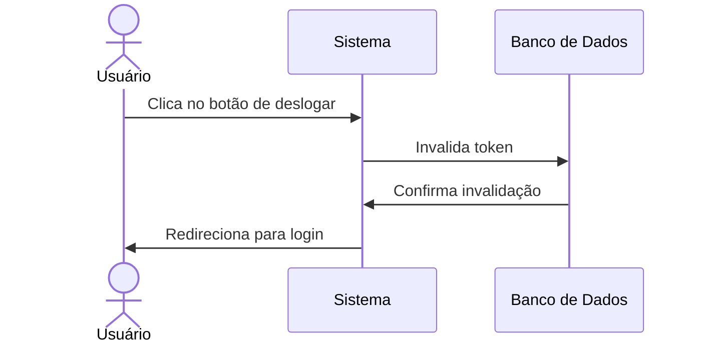

# 🔒 RF09 - Deslogar Usuário 

{ width=150 }

## 📝 Descrição

Este requisito é responsável por permitir que o usuário deslogue do sistema.

## 👥 Atores

- 👤 Usuário

## ⚠️ Pré-condições

- O usuário deve estar logado no sistema.

## 🔌 Endpoints

- `POST /api/end-session`

## 📋 Dados do Logout

| Campo   | Tipo     | Obrigatório | Descrição            | Restrições |
|---------|----------|-------------|----------------------|------------|
| `token` | `string` | ✅ Sim      | Token jwt do usuário |            |

## 🔄 Fluxo Principal



1. O usuário clica no botão de deslogar.
2. O sistema invalida o token do usuário.
3. O sistema redireciona o usuário para a página de login.

## 🔀 Fluxos Alternativos

- Não se aplica.

## 🚫 Fluxos de Exceção

- Não se aplica.

## 🧪 Exemplos de Uso

### Requisição HTTP
```http
POST /api/end-session HTTP/1.1
Host: api.metakyasshu.com
Authorization: Bearer {token}
```

### Resposta
```http
HTTP/1.1 200 OK
Content-Type: application/json

{
  "message": "Sessão encerrada com sucesso"
}
```

> ---------------------------------------------------------------------------
> #### 💰 Sistema de Gestão Financeira 💰
> ***Controlando suas finanças de forma simples e eficiente***
> ---------------------------------------------------------------------------
