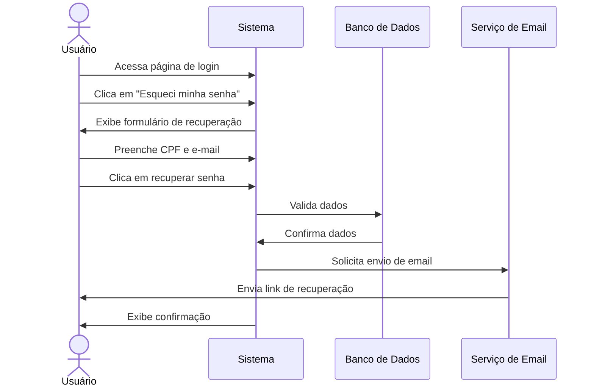

# 🆘 RF10 - Recuperar acesso

{ width=150 }

## 📝 Descrição

Este requisito é responsável por permitir que o usuário recupere o acesso ao sistema, ao clicar no link "Esqueci minha senha".

## 👥 Atores

- 👤 Usuário

## ⚠️ Pré-condições

- O usuário deve estar cadastrado no sistema.

## 🔌 Endpoints

- `POST /api/user/recover-access`

## 📋 Dados da Recuperação

| Campo   | Tipo     | Obrigatório | Descrição         | Restrições     |
|---------|----------|-------------|-------------------|----------------|
| `cpf`   | `string` | ✅ Sim      | CPF do usuário    | CPF válido     |
| `email` | `string` | ✅ Sim      | E-mail do usuário | E-mail válido  |

## 🔄 Fluxo Principal



1. O usuário acessa a página de login.
2. O usuário clica no link "Esqueci minha senha".
3. O sistema exibe um formulário para recuperação de senha.
4. O usuário preenche o formulário com o CPF e o e-mail.
5. O usuário clica no botão de recuperar senha.
6. O sistema valida os dados.
7. O sistema envia um e-mail com um link para recuperação de senha.

## 🔀 Fluxos Alternativos

- Não se aplica.

## 🚫 Fluxos de Exceção

### ⚠️ FE01 - Dados inválidos
1. No passo 6 do Fluxo Principal, se os dados não atenderem aos requisitos mínimos de segurança, o sistema exibe uma mensagem de erro.
2. O sistema redireciona o usuário para a página de recuperação de senha.

### ⚠️ FE02 - Usuário não cadastrado
1. No passo 6 do Fluxo Principal, se o usuário não estiver cadastrado no sistema, ou o CPF e o e-mail não pertencerem ao mesmo usuário, o sistema exibe uma mensagem de erro.
2. O sistema redireciona o usuário para a página de recuperação de senha.

### ⚠️ FE03 - CPF inválido
1. No passo 6 do Fluxo Principal, se o CPF não for válido, o sistema exibe uma mensagem de erro.
2. O sistema redireciona o usuário para a página de recuperação de senha.

### ⚠️ FE04 - E-mail inválido
1. No passo 6 do Fluxo Principal, se o e-mail não for válido, o sistema exibe uma mensagem de erro.
2. O sistema redireciona o usuário para a página de recuperação de senha.

## 🧪 Exemplos de Uso

### Requisição HTTP
```http
POST /api/user/recover-access HTTP/1.1
Host: api.metakyasshu.com
Content-Type: application/json

{
  "cpf": "123.456.789-00",
  "email": "joao@email.com"
}
```

### Resposta
```http
HTTP/1.1 200 OK
Content-Type: application/json

{
  "message": "E-mail de recuperação enviado com sucesso"
}
```

> ---------------------------------------------------------------------------
> #### 💰 Sistema de Gestão Financeira 💰
> ***Controlando suas finanças de forma simples e eficiente***
> ---------------------------------------------------------------------------