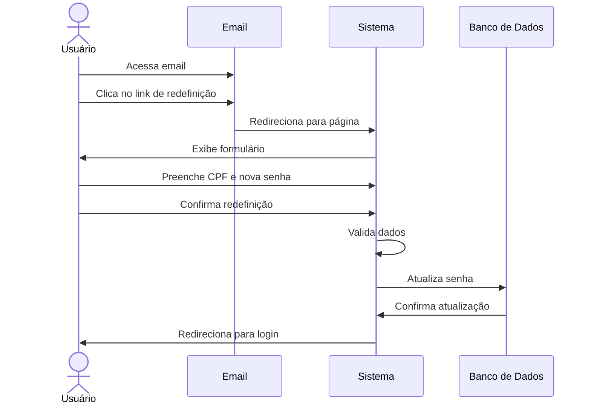

# 🔄 RF11 - Redefinir Senha 

{ width=150 }

## 📝 Descrição

Este requisito é responsável por permitir que o usuário redefina a sua senha no sistema a partir de um link enviado por e-mail.

## 👥 Atores

- 👤 Usuário

## ⚠️ Pré-condições

- O usuário deve ter solicitado a redefinição de senha.
- O link de redefinição de senha deve estar válido.

## 🔌 Endpoints

- `POST /api/user/reset-password/:token`

## 📋 Dados da Redefinição

| Campo      | Tipo     | Obrigatório | Descrição                     | Restrições             |
|------------|----------|-------------|-------------------------------|------------------------|
| `cpf`      | `string` | ✅ Sim      | CPF do usuário                |                        |
| `password` | `string` | ✅ Sim      | Nova senha                    | Mínimo de 8 caracteres |
| `token`    | `string` | ✅ Sim      | Token de redefinição de senha |                        |

## 🔄 Fluxo Principal



1. O usuário acessa o e-mail com o link de redefinição de senha.
2. O usuário clica no link de redefinição de senha.
3. O sistema exibe um formulário para redefinição de senha.
4. O usuário preenche o formulário com seu CPF e a nova senha.
5. O usuário clica no botão de confirmar redefinição.
6. O sistema valida os dados.
7. O sistema atualiza a senha do usuário.
8. O sistema redireciona o usuário para a página de login.

## 🔀 Fluxos Alternativos

- Não se aplica.

## 🚫 Fluxos de Exceção

### ⚠️ FE01 - Token inválido
1. No passo 3 do Fluxo Principal, se o token de redefinição de senha for inválido ou tiver expirado, o sistema exibe uma mensagem de erro.
2. O sistema redireciona o usuário para a página de recuperação de acesso.

### ⚠️ FE02 - CPF inválido
1. No passo 6 do Fluxo Principal, se o CPF não for válido ou não corresponder ao token, o sistema exibe uma mensagem de erro.
2. O sistema redireciona o usuário para a página de redefinição de senha.

### ⚠️ FE03 - Senha inválida
1. No passo 6 do Fluxo Principal, se a senha não atender aos requisitos mínimos de segurança, o sistema exibe uma mensagem de erro.
2. O sistema redireciona o usuário para a página de redefinição de senha.

## 🧪 Exemplos de Uso

### Requisição HTTP
```http
POST /api/user/reset-password/abcdef123456 HTTP/1.1
Host: api.metakyasshu.com
Content-Type: application/json

{
  "cpf": "123.456.789-00",
  "password": "NovaSenha@123"
}
```

### Resposta
```http
HTTP/1.1 200 OK
Content-Type: application/json

{
  "message": "Senha redefinida com sucesso"
}
```


> ---------------------------------------------------------------------------
> #### 💰 Sistema de Gestão Financeira 💰
> ***Controlando suas finanças de forma simples e eficiente***
> ---------------------------------------------------------------------------
