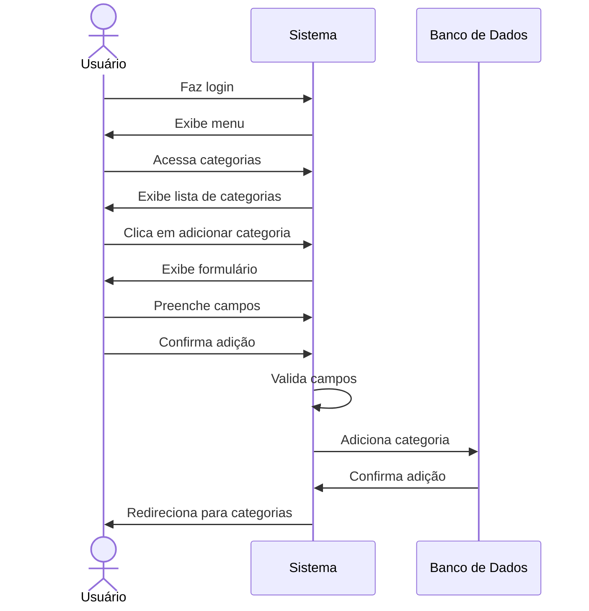

# 🏷️ RF12 - Cadastrar Categoria 

{ width=150 }

## 📝 Descrição

Este requisito tem como objetivo permitir que o usuário cadastre uma categoria, que será utilizada para classificar as despesas e metas.

## 👥 Atores

- 👤 Usuário

## ⚠️ Pré-condições

- O usuário deve estar autenticado no sistema.

## 🔌 Endpoints

- `POST /api/category`

## 📋 Dados da Categoria

| Campo   | Tipo     | Obrigatório | Descrição            | Restrições                    |
|---------|----------|-------------|----------------------|-------------------------------|
| `name`  | `string` | ✅ Sim      | Nome da categoria    | Mínimo de 3 caracteres        |
| `group` | `enum`   | ✅ Sim      | Grupo da categoria   |                               |
| `icon`  | `file`   | ❌ Não      | Ícone da categoria   | JPEG, PNG, SVG, Máximo de 1MB |
| `token` | `string` | ✅ Sim      | Token jwt do usuário |                               |

## 🔄 Fluxo Principal



1. O usuário faz login no sistema.
2. O usuário acessa a opção no menu de categorias.
3. O sistema exibe a lista de categorias.
4. O usuário clica no botão de adicionar categoria.
5. O sistema exibe um formulário para adicionar categoria.
6. O usuário preenche os campos do formulário.
7. O usuário clica no botão de confirmar adição.
8. O sistema valida os campos.
9. O sistema adiciona a categoria.
10. O usuário é redirecionado para a página de categorias.

## 🔀 Fluxos Alternativos

### ⚠️ FA01 - Cancelar adição
1. O usuário faz login no sistema.
2. O usuário acessa a opção no menu de categorias.
3. O sistema exibe a lista de categorias.
4. O usuário clica no botão de adicionar categoria.
5. O sistema exibe um formulário para adicionar categoria.
6. O usuário clica no botão de cancelar adição.
7. O usuário é redirecionado para a página de categorias.

## 🚫 Fluxos de Exceção

### ⚠️ FE01 - Campos inválidos
1. No passo 8 do Fluxo Principal, se os campos não atenderem aos requisitos mínimos de segurança, o sistema exibe uma mensagem de erro.
2. O sistema redireciona o usuário para a página de adição de categoria.

### ⚠️ FE02 - Categoria já existente
1. No passo 8 do Fluxo Principal, se a categoria já existir, o sistema exibe uma mensagem de erro.
2. O sistema redireciona o usuário para a página de adição de categoria.

### ⚠️ FE03 - Ícone inválido
1. No passo 8 do Fluxo Principal, se o ícone não atender aos requisitos mínimos de segurança, o sistema exibe uma mensagem de erro.
2. O sistema redireciona o usuário para a página de adição de categoria.

## 🧪 Exemplos de Uso

### Requisição HTTP
```http
POST /api/category HTTP/1.1
Host: api.metakyasshu.com
Content-Type: multipart/form-data
Authorization: Bearer {token}

--boundary
Content-Disposition: form-data; name="name"
Alimentação

--boundary
Content-Disposition: form-data; name="group"
DESPESA

--boundary
Content-Disposition: form-data; name="icon"; filename="food-icon.png"
Content-Type: image/png

[Dados binários da imagem]
--boundary--
```

### Resposta
```http
HTTP/1.1 201 Created
Content-Type: application/json

{
  "id": 123,
  "name": "Alimentação",
  "group": "DESPESA",
  "icon": "https://api.metakyasshu.com/uploads/icons/food-icon.png"
}
```

> ---------------------------------------------------------------------------
> #### 💰 Sistema de Gestão Financeira 💰
> ***Controlando suas finanças de forma simples e eficiente***
> ---------------------------------------------------------------------------