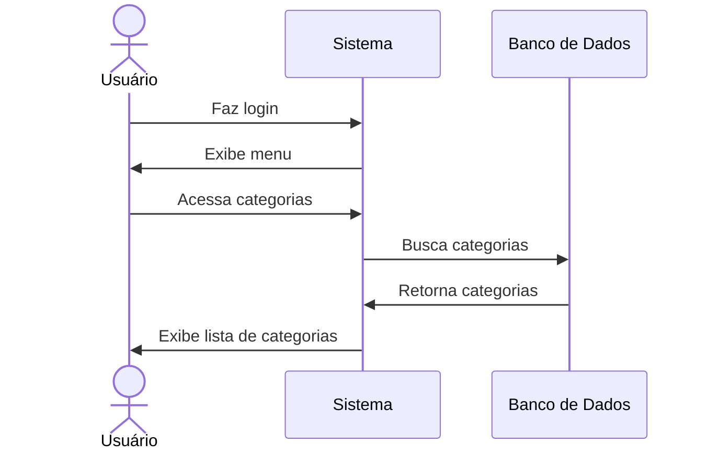

# 📋 RF13 - Listar Categorias 

{ width=150 }

## 📝 Descrição

Este requisito é responsável por permitir que o usuário visualize a lista de categorias tanto as cadastradas por ele quanto as padrão do sistema.

## 👥 Atores

- 👤 Usuário

## ⚠️ Pré-condições

- O usuário deve estar autenticado no sistema.

## 🔌 Endpoints

- `GET /api/category`

## 📋 Dados da Requisição

| Campo   | Tipo     | Obrigatório | Descrição            | Restrições |
|---------|----------|-------------|----------------------|------------|
| `token` | `string` | ✅ Sim      | Token jwt do usuário |            |

## 🔄 Fluxo Principal



1. O usuário faz login no sistema.
2. O usuário acessa a opção no menu de categorias.
3. O sistema exibe a lista de categorias.

## 🔀 Fluxos Alternativos

- Não se aplica

## 🚫 Fluxos de Exceção

- Não se aplica

## 🧪 Exemplos de Uso

### Requisição HTTP
```http
GET /api/category HTTP/1.1
Host: api.metakyasshu.com
Authorization: Bearer {token}
```

### Resposta
```http
HTTP/1.1 200 OK
Content-Type: application/json

{
  "categories": [
    {
      "id": 1,
      "name": "Alimentação",
      "group": "DESPESA",
      "icon": "https://api.metakyasshu.com/uploads/icons/food-icon.png",
      "isDefault": true
    },
    {
      "id": 2,
      "name": "Transporte",
      "group": "DESPESA",
      "icon": "https://api.metakyasshu.com/uploads/icons/transport-icon.png",
      "isDefault": true
    },
    {
      "id": 123,
      "name": "Viagem",
      "group": "DESPESA",
      "icon": "https://api.metakyasshu.com/uploads/icons/travel-icon.png",
      "isDefault": false
    }
  ]
}
```

> ---------------------------------------------------------------------------
> #### 💰 Sistema de Gestão Financeira 💰
> ***Controlando suas finanças de forma simples e eficiente***
> ---------------------------------------------------------------------------