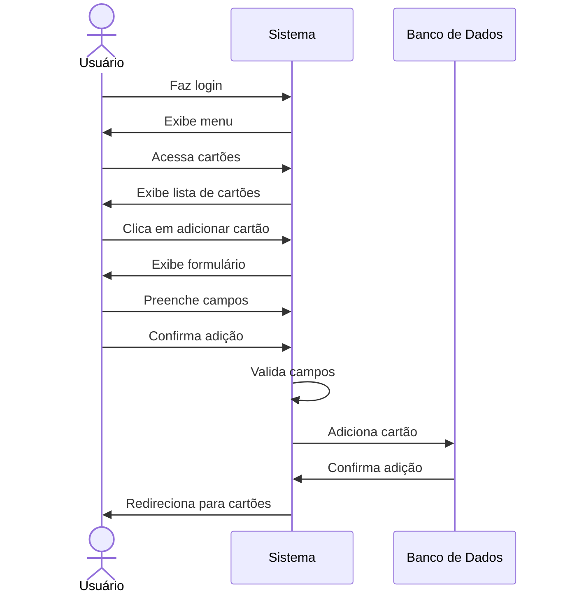

# 💳 RF14 - Adicionar Cartão 

{ width=150 }

## 📝 Descrição

Este requisito é responsável por permitir que o usuário adicione um cartão de compra para registrar as despesas.

## 👥 Atores

- 👤 Usuário

## ⚠️ Pré-condições

- O usuário deve estar autenticado no sistema.

## 🔌 Endpoints

- `POST /api/card`

## 📋 Dados do Cartão

| Campo        | Tipo     | Obrigatório | Descrição                    | Restrições             |
|--------------|----------|-------------|------------------------------|------------------------|
| `token`      | `string` | ✅ Sim      | Token jwt do usuário         |                        |
| `number`     | `string` | ✅ Sim      | Número do cartão             |                        |
| `name`       | `string` | ❌ Não      | Identificação do cartão      |                        |
| `expiration` | `string` | ✅ Sim      | Data de vencimento da fatura | Maior que a data atual |  
| `function`   | `enum`   | ✅ Sim      | Função do cartão             |                        |

## 🔄 Fluxo Principal



1. O usuário faz login no sistema.
2. O usuário acessa a opção no menu de cartões.
3. O sistema exibe a lista de cartões.
4. O usuário clica no botão de adicionar cartão.
5. O sistema exibe um formulário para adicionar cartão.
6. O usuário preenche os campos do formulário.
7. O usuário clica no botão de confirmar adição.
8. O sistema valida os campos.
9. O sistema adiciona o cartão.
10. O usuário é redirecionado para a página de cartões.

## 🔀 Fluxos Alternativos

### ⚠️ FA01 - Cancelar adição
1. O usuário faz login no sistema.
2. O usuário acessa a opção no menu de cartões.
3. O sistema exibe a lista de cartões.
4. O usuário clica no botão de adicionar cartão.
5. O sistema exibe um formulário para adicionar cartão.
6. O usuário clica no botão de cancelar adição.
7. O usuário é redirecionado para a página de cartões.

## 🚫 Fluxos de Exceção

### ⚠️ FE01 - Campos inválidos
1. No passo 8 do Fluxo Principal, se os campos não atenderem aos requisitos mínimos de segurança, o sistema exibe uma mensagem de erro.
2. O sistema redireciona o usuário para a página de adição de cartão.

### ⚠️ FE02 - Cartão já existente
1. No passo 8 do Fluxo Principal, se o cartão já existir, o sistema exibe uma mensagem de erro.
2. O sistema redireciona o usuário para a página de adição de cartão.

## 🧪 Exemplos de Uso

### Requisição HTTP
```http
POST /api/card HTTP/1.1
Host: api.metakyasshu.com
Content-Type: application/json
Authorization: Bearer {token}

{
  "number": "1234 5678 9012 3456",
  "name": "Cartão Principal",
  "expiration": "2025-12-31",
  "function": "CREDIT"
}
```

### Resposta
```http
HTTP/1.1 201 Created
Content-Type: application/json

{
  "id": 123,
  "number": "1234 5678 9012 3456",
  "name": "Cartão Principal",
  "expiration": "2025-12-31",
  "function": "CREDIT"
}
```


> ---------------------------------------------------------------------------
> #### 💰 Sistema de Gestão Financeira 💰
> ***Controlando suas finanças de forma simples e eficiente***
> ---------------------------------------------------------------------------