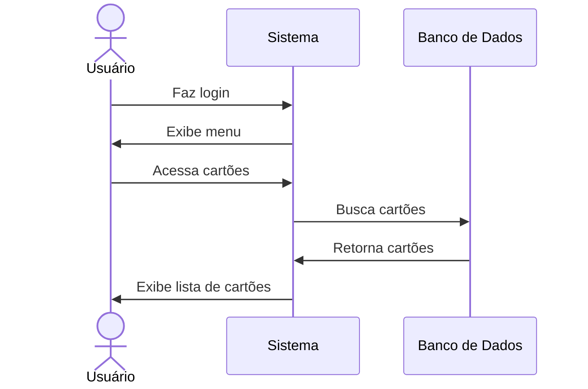

# 💳 RF15 - Listar Cartões 

{ width=150 }

## 📝 Descrição

Este requisito é responsável por permitir que o usuário visualize a lista de cartões cadastrados no sistema.

## 👥 Atores

- 👤 Usuário

## ⚠️ Pré-condições

- O usuário deve estar autenticado no sistema.

## 🔌 Endpoints

- `GET /api/card`

## 📋 Dados da Requisição

| Campo      | Tipo     | Obrigatório | Descrição               | Restrições |
|------------|----------|-------------|-------------------------|------------|
| `token`    | `string` | ✅ Sim      | Token jwt do usuário    |            |
| `function` | `enum`   | ❌ Não      | Função do cartão        |            |
| `name`     | `string` | ❌ Não      | Identificação do cartão |            |
| `number`   | `string` | ❌ Não      | Número do cartão        |            |

## 🔄 Fluxo Principal



1. O usuário faz login no sistema.
2. O usuário acessa a opção no menu de cartões.
3. O sistema exibe a lista de cartões.

## 🔀 Fluxos Alternativos

### ⚠️ FA01 - Filtrar cartões
1. O usuário faz login no sistema.
2. O usuário acessa a opção no menu de cartões.
3. O sistema exibe a lista de cartões.
4. O usuário preenche os campos de filtro.
5. O sistema exibe a lista de cartões filtrada.

## 🚫 Fluxos de Exceção

- Não se aplica

## 🧪 Exemplos de Uso

### Requisição HTTP
```http
GET /api/card HTTP/1.1
Host: api.metakyasshu.com
Authorization: Bearer {token}
```

### Resposta
```http
HTTP/1.1 200 OK
Content-Type: application/json

{
  "cards": [
    {
      "id": 123,
      "number": "1234 5678 9012 3456",
      "name": "Cartão Principal",
      "expiration": "2025-12-31",
      "function": "CREDIT"
    },
    {
      "id": 124,
      "number": "9876 5432 1098 7654",
      "name": "Cartão Secundário",
      "expiration": "2024-06-30",
      "function": "DEBIT"
    }
  ]
}
```

### Requisição com Filtros
```http
GET /api/card?function=CREDIT&name=Principal HTTP/1.1
Host: api.metakyasshu.com
Authorization: Bearer {token}
```

> ---------------------------------------------------------------------------
> #### 💰 Sistema de Gestão Financeira 💰
> ***Controlando suas finanças de forma simples e eficiente***
> ---------------------------------------------------------------------------