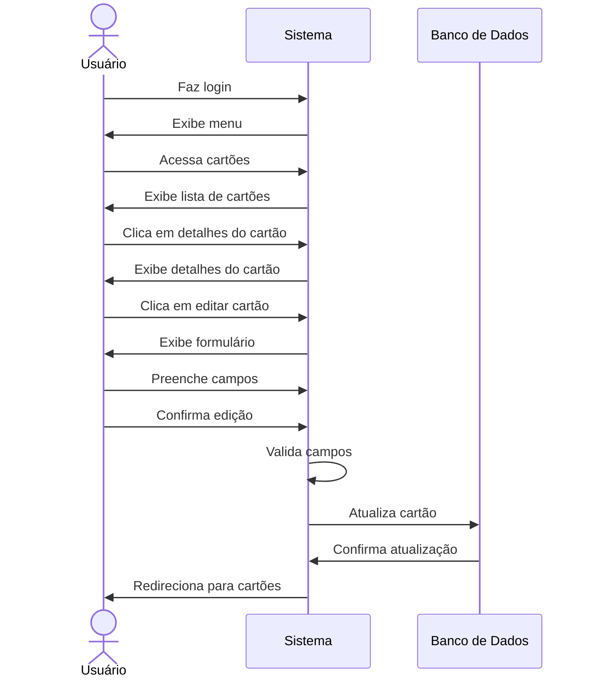

# 💳 RF16 - Editar Cartão 

{ width=150 }

## 📝 Descrição

Este requisito é responsável por permitir que o usuário edite um cartão já criado.

## 👥 Atores

- 👤 Usuário

## ⚠️ Pré-condições

- O usuário deve estar autenticado no sistema.
- O cartão deve estar cadastrado no sistema.
- O cartão deve pertencer ao usuário autenticado.

## 🔌 Endpoints

- `PUT /api/card/:pkCard`

## 📋 Dados do Cartão

| Campo      | Tipo     | Obrigatório | Descrição               | Restrições |
|------------|----------|-------------|-------------------------|------------|
| `token`    | `string` | ✅ Sim      | Token jwt do usuário    |            |
| `function` | `enum`   | ❌ Não      | Função do cartão        |            |
| `name`     | `string` | ❌ Não      | Identificação do cartão |            |
| `number`   | `string` | ❌ Não      | Número do cartão        |            |

## 🔄 Fluxo Principal



1. O usuário faz login no sistema.
2. O usuário acessa a opção no menu de cartões.
3. O sistema exibe a lista de cartões.
4. O usuário clica no botão de detalhes do cartão.
5. O sistema exibe os detalhes do cartão.
6. O usuário clica no botão de editar cartão.
7. O sistema exibe um formulário para editar o cartão.
8. O usuário preenche os campos do formulário.
9. O usuário clica no botão de confirmar edição.
10. O sistema valida os campos.
11. O sistema edita o cartão.
12. O usuário é redirecionado para a página de cartões.

## 🔀 Fluxos Alternativos

### ⚠️ FA01 - Cancelar edição
1. O usuário faz login no sistema.
2. O usuário acessa a opção no menu de cartões.
3. O sistema exibe a lista de cartões.
4. O usuário clica no botão de detalhes do cartão.
5. O sistema exibe os detalhes do cartão.
6. O usuário clica no botão de editar cartão.
7. O sistema exibe um formulário para editar o cartão.
8. O usuário clica no botão de cancelar edição.
9. O usuário é redirecionado para a página de cartões.

## 🚫 Fluxos de Exceção

### ⚠️ FE01 - Campos inválidos
1. No passo 10 do Fluxo Principal, se os campos não atenderem aos requisitos mínimos de segurança, o sistema exibe uma mensagem de erro.
2. O sistema redireciona o usuário para a página de edição de cartão.

### ⚠️ FE02 - Cartão não encontrado
1. No passo 10 do Fluxo Principal, se o cartão não for encontrado, o sistema exibe uma mensagem de erro.
2. O sistema redireciona o usuário para a página de cartões.

### ⚠️ FE03 - Cartão não pertence ao usuário
1. No passo 10 do Fluxo Principal, se o cartão não pertencer ao usuário autenticado, o sistema exibe uma mensagem de erro.
2. O sistema redireciona o usuário para a página de cartões.

## 🧪 Exemplos de Uso

### Requisição HTTP
```http
PUT /api/card/123 HTTP/1.1
Host: api.metakyasshu.com
Content-Type: application/json
Authorization: Bearer {token}

{
  "name": "Cartão Principal Atualizado",
  "function": "CREDIT_DEBIT"
}
```

### Resposta
```http
HTTP/1.1 200 OK
Content-Type: application/json

{
  "id": 123,
  "number": "1234 5678 9012 3456",
  "name": "Cartão Principal Atualizado",
  "expiration": "2025-12-31",
  "function": "CREDIT_DEBIT"
}
```


> ---------------------------------------------------------------------------
> #### 💰 Sistema de Gestão Financeira 💰
> ***Controlando suas finanças de forma simples e eficiente***
> ---------------------------------------------------------------------------