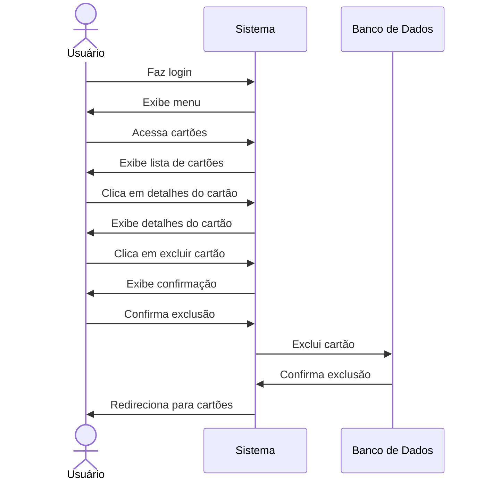

# 💳 RF17 - Excluir Cartão 

{ width=150 }

## 📝 Descrição

Este requisito é responsável por permitir que o usuário exclua um cartão já cadastrado.

## 👥 Atores

- 👤 Usuário

## ⚠️ Pré-condições

- O usuário deve estar autenticado no sistema.
- O cartão deve estar cadastrado no sistema.
- O cartão deve pertencer ao usuário autenticado.
- O cartão não pode estar associado a uma despesa.

## 🔌 Endpoints

- `DELETE /api/card/:pkCard`

## 📋 Dados da Requisição

| Campo   | Tipo     | Obrigatório | Descrição            | Restrições |
|---------|----------|-------------|----------------------|------------|
| `token` | `string` | ✅ Sim      | Token jwt do usuário |            |

## 🔄 Fluxo Principal



1. O usuário faz login no sistema.
2. O usuário acessa a opção no menu de cartões.
3. O sistema exibe a lista de cartões.
4. O usuário clica no botão de detalhes do cartão.
5. O sistema exibe os detalhes do cartão.
6. O usuário clica no botão de excluir cartão.
7. O sistema exibe uma mensagem de confirmação.
8. O usuário confirma a exclusão.
9. O sistema exclui o cartão.
10. O usuário é redirecionado para a página de cartões.

## 🔀 Fluxos Alternativos

### ⚠️ FA01 - Cancelar exclusão
1. O usuário faz login no sistema.
2. O usuário acessa a opção no menu de cartões.
3. O sistema exibe a lista de cartões.
4. O usuário clica no botão de detalhes do cartão.
5. O sistema exibe os detalhes do cartão.
6. O usuário clica no botão de excluir cartão.
7. O sistema exibe uma mensagem de confirmação.
8. O usuário cancela a exclusão.
9. O usuário é redirecionado para a página de cartões.

## 🚫 Fluxos de Exceção

### ⚠️ FE01 - Cartão associado a despesa
1. No passo 7 do Fluxo Principal, se o cartão estiver associado a uma despesa, o sistema exibe uma mensagem de erro.
2. O sistema redireciona o usuário para a página de cartões.

### ⚠️ FE02 - Cartão não encontrado
1. No passo 5 do Fluxo Principal, se o cartão não for encontrado, o sistema exibe uma mensagem de erro.
2. O sistema redireciona o usuário para a página de cartões.

### ⚠️ FE03 - Cartão não pertence ao usuário
1. No passo 6 do Fluxo Principal, se o cartão não pertencer ao usuário autenticado, o sistema exibe uma mensagem de erro.
2. O sistema redireciona o usuário para a página de cartões.

## 🧪 Exemplos de Uso

### Requisição HTTP
```http
DELETE /api/card/123 HTTP/1.1
Host: api.metakyasshu.com
Authorization: Bearer {token}
```

### Resposta
```http
HTTP/1.1 200 OK
Content-Type: application/json

{
  "message": "Cartão excluído com sucesso"
}
```


> ---------------------------------------------------------------------------
> #### 💰 Sistema de Gestão Financeira 💰
> ***Controlando suas finanças de forma simples e eficiente***
> ---------------------------------------------------------------------------
