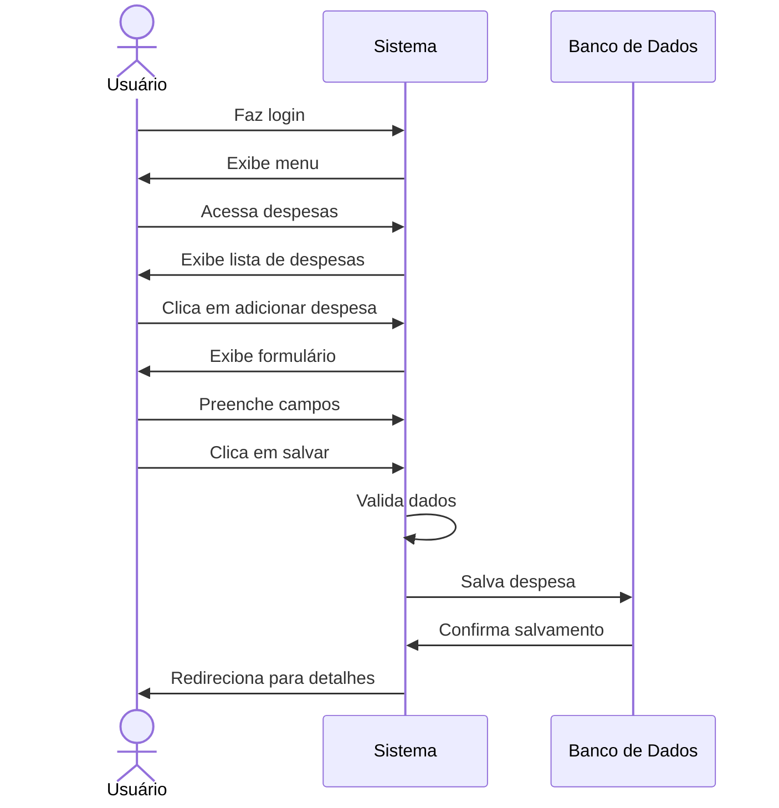

# 💸 RF18 - Adicionar Despesa 

{ width=150 }

## 📝 Descrição

Como um usuário, eu quero adicionar uma despesa para que eu possa registrar meus gastos.

## 👥 Atores

- 👤 Usuário

## ⚠️ Pré-condições

- O usuário deve estar autenticado no sistema.

## 🔌 Endpoints

- `POST /api/expense`

## 📋 Dados da Despesa

| Campo          | Tipo          | Obrigatório | Descrição            | Restrições             |
|----------------|---------------|-------------|----------------------|------------------------|
| `token`        | `string`      | ✅ Sim      | Token jwt do usuário |                        |
| `name`         | `string`      | ✅ Sim      | Nome da despesa      |                        |
| `description`  | `string`      | ❌ Não      | Descrição da despesa |                        |
| `value`        | `big decimal` | ✅ Sim      | Valor da despesa     | Maior que 0            |
| `date vencto`  | `date`        | ✅ Sim      | Data de vencimento   | Maior que a data atual |
| `category`     | `long`        | ✅ Sim      | Categoria da despesa |                        |
| `card`         | `long`        | ❌ Não      | Cartão da despesa    |                        |
| `parcel`       | `int`         | ❌ Não      | Número de parcelas   | Maior que 0            |
| `installment`  | `int`         | ❌ Não      | Número da parcela    | Maior que 0            |
| `type`         | `enum`        | ❌ Não      | Tipo da despesa      |                        |
| `access level` | `enum`        | ❌ Não      | Nível de acesso      |                        |
| `barcode`      | `string`      | ❌ Não      | Código de barras     |                        |

## 🔄 Fluxo Principal



1. O usuário faz login no sistema.
2. O usuário acessa a opção no menu de despesas.
3. O sistema exibe a lista de despesas.
4. O usuário clica no botão de adicionar despesa.
5. O sistema exibe o formulário de adição de despesa.
6. O usuário preenche os campos do formulário.
7. O usuário clica no botão de salvar.
8. O sistema salva a despesa.
9. O usuário é redirecionado para a página de detalhes da despesa.

## 🔀 Fluxos Alternativos

### ⚠️ FA01 - Cancelar adição
1. O usuário faz login no sistema.
2. O usuário acessa a opção no menu de despesas.
3. O sistema exibe a lista de despesas.
4. O usuário clica no botão de adicionar despesa.
5. O sistema exibe o formulário de adição de despesa.
6. O usuário clica no botão de cancelar.
7. O usuário é redirecionado para a página de despesas.

## 🚫 Fluxos de Exceção

### ⚠️ FE01 - Campos obrigatórios não preenchidos
1. No passo 7 do Fluxo Principal, se algum campo obrigatório não for preenchido, o sistema exibe uma mensagem de erro.
2. O sistema redireciona o usuário para o formulário de adição de despesa.

### ⚠️ FE02 - Valor da despesa inválido
1. No passo 7 do Fluxo Principal, se o valor da despesa for inválido, o sistema exibe uma mensagem de erro.
2. O sistema redireciona o usuário para o formulário de adição de despesa.

### ⚠️ FE03 - Data de vencimento inválida
1. No passo 7 do Fluxo Principal, se a data de vencimento for inválida, o sistema exibe uma mensagem de erro.
2. O sistema redireciona o usuário para o formulário de adição de despesa.

## 🧪 Exemplos de Uso

### Requisição HTTP
```http
POST /api/expense HTTP/1.1
Host: api.metakyasshu.com
Content-Type: application/json
Authorization: Bearer {token}

{
  "name": "Conta de Luz",
  "description": "Fatura de energia do mês de junho",
  "value": 150.75,
  "dateVencto": "2023-06-15",
  "category": 2,
  "card": null,
  "parcel": 1,
  "installment": 1,
  "type": "BILL",
  "accessLevel": "PRIVATE",
  "barcode": "83640000001507501620000210904204679900275686"
}
```

### Resposta
```http
HTTP/1.1 201 Created
Content-Type: application/json

{
  "id": 456,
  "name": "Conta de Luz",
  "description": "Fatura de energia do mês de junho",
  "value": 150.75,
  "dateVencto": "2023-06-15",
  "category": {
    "id": 2,
    "name": "Utilidades",
    "group": "DESPESA"
  },
  "status": "PENDING"
}
```

> ---------------------------------------------------------------------------
> #### 💰 Sistema de Gestão Financeira 💰
> ***Controlando suas finanças de forma simples e eficiente***
> ---------------------------------------------------------------------------