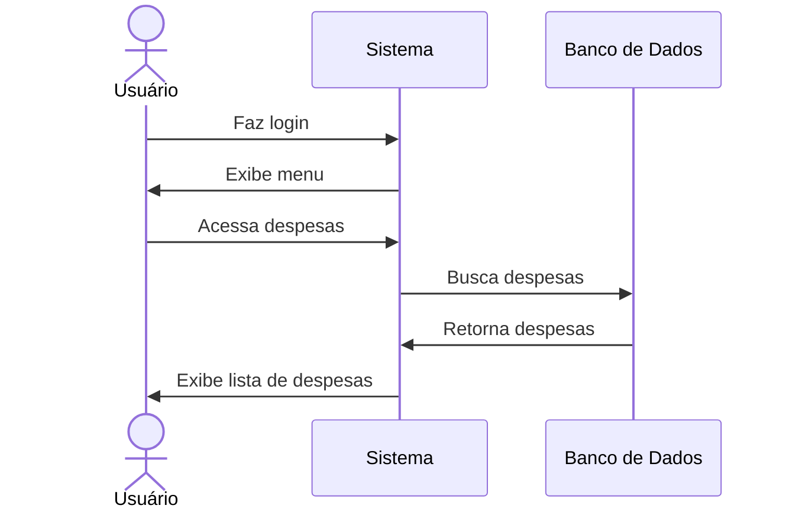

# 💸 RF19 - Listar Despesas 

{ width=150 }

## 📝 Descrição

Este requisito é responsável por permitir que o usuário visualize a lista de despesas cadastradas no sistema.

## 👥 Atores

- 👤 Usuário
- 👥 Colaborador

## ⚠️ Pré-condições

- O usuário deve estar autenticado no sistema.
- O colaborador deve estar autenticado no sistema.
- O usuário deve ter compartilhado a despesa com o colaborador.

## 🔌 Endpoints

- `GET /api/expense`

## 📋 Dados da Requisição

| Campo          | Tipo     | Obrigatório | Descrição                       | Restrições |
|----------------|----------|-------------|---------------------------------|------------|
| `token`        | `string` | ✅ Sim      | Token jwt do usuário            |            |
| `name`         | `string` | ❌ Não      | Nome da despesa                 |            |
| `category`     | `string` | ❌ Não      | Categoria da despesa            |            |
| `date`         | `string` | ❌ Não      | Data da despesa                 |            |
| `type`         | `string` | ❌ Não      | Tipo da despesa                 |            |
| `expiration`   | `enum`   | ❌ Não      | Despesas com vencimento próximo |            |
| `access level` | `enum`   | ❌ Não      | Nível de acesso                 |            |

## 🔄 Fluxo Principal



1. O usuário faz login no sistema.
2. O usuário acessa a opção no menu de despesas.
3. O sistema exibe a lista de despesas.

## 🔀 Fluxos Alternativos

### ⚠️ FA01 - Filtrar despesas
1. O usuário faz login no sistema.
2. O usuário acessa a opção no menu de despesas.
3. O sistema exibe a lista de despesas.
4. O usuário preenche os campos de filtro.
5. O sistema exibe a lista de despesas filtrada.

## 🚫 Fluxos de Exceção

- Não se aplica

## 🧪 Exemplos de Uso

### Requisição HTTP
```http
GET /api/expense HTTP/1.1
Host: api.metakyasshu.com
Authorization: Bearer {token}
```

### Resposta
```http
HTTP/1.1 200 OK
Content-Type: application/json

{
  "expenses": [
    {
      "id": 456,
      "name": "Conta de Luz",
      "description": "Fatura de energia do mês de junho",
      "value": 150.75,
      "dateVencto": "2023-06-15",
      "category": {
        "id": 2,
        "name": "Utilidades",
        "group": "DESPESA"
      },
      "status": "PENDING"
    },
    {
      "id": 457,
      "name": "Supermercado",
      "description": "Compras do mês",
      "value": 450.25,
      "dateVencto": "2023-06-20",
      "category": {
        "id": 1,
        "name": "Alimentação",
        "group": "DESPESA"
      },
      "status": "PENDING"
    }
  ]
}
```

### Requisição com Filtros
```http
GET /api/expense?category=2&expiration=NEXT_WEEK HTTP/1.1
Host: api.metakyasshu.com
Authorization: Bearer {token}
```

> ---------------------------------------------------------------------------
> #### 💰 Sistema de Gestão Financeira 💰
> ***Controlando suas finanças de forma simples e eficiente***
> ---------------------------------------------------------------------------