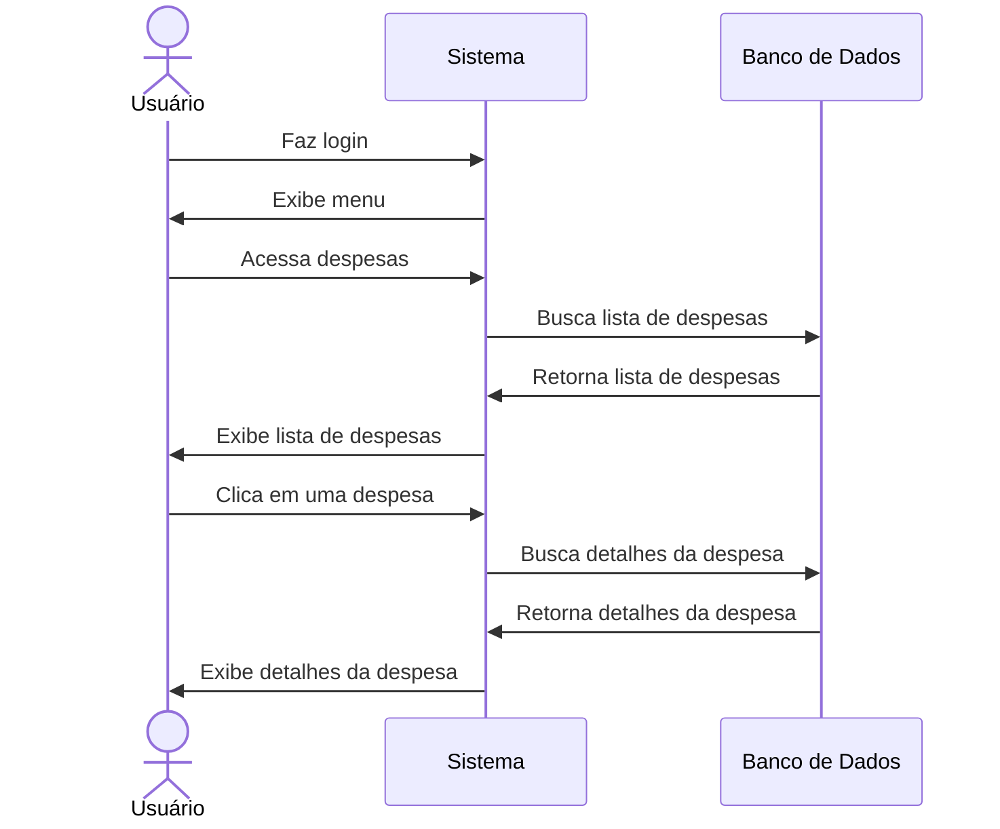

# 💸 RF21 - Visualizar Despesa

{ width=150 }

## 📝 Descrição

O sistema deve permitir que o usuário visualize uma despesa.

## 👥 Atores

- 👤 Usuário
- 👥 Colaborador

## ⚠️ Pré-condições

- O usuário deve estar autenticado no sistema.
- O usuário deve possuir permissão para visualizar despesas.
- A despesa deve existir no sistema.

## 🔌 Endpoints

- `GET /api/expense/:pkExpense`

## 📋 Dados da Requisição

| Campo       | Tipo      | Obrigatório | Descrição                 | Restrições |
|-------------|-----------|-------------|---------------------------|------------|
| `token`     | `string`  | ✅ Sim      | Token jwt do usuário      |            |
| `pkExpense` | `long`    | ✅ Sim      | Chave primária da despesa |            |

## 🔄 Fluxo Principal



1. O usuário faz login no sistema.
2. O usuário acessa a opção no menu de visualizar despesas.
3. O sistema exibe a lista de despesas.
4. O usuário clica na despesa que deseja visualizar.
5. O sistema exibe as informações da despesa.

## 🔀 Fluxos Alternativos

- Não se aplica.

## 🚫 Fluxos de Exceção

### ⚠️ FE01 - Token inválido
1. No passo 3 do fluxo principal, se o token informado for inválido, o sistema exibe uma mensagem de erro.
2. O sistema redireciona o usuário para a página de login.

### ⚠️ FE02 - Usuário não logado
1. No passo 2 do fluxo principal, se o usuário não estiver logado, o sistema exibe uma mensagem de erro.
2. O sistema redireciona o usuário para a página de login.

### ⚠️ FE03 - Usuário sem permissão
1. No passo 2 do fluxo principal, se o usuário não possuir permissão para visualizar despesas, o sistema exibe uma mensagem de erro.
2. O sistema redireciona o usuário para a página de visualização de despesas.

### ⚠️ FE04 - Despesa não encontrada
1. No passo 4 do fluxo principal, se a despesa não for encontrada, o sistema exibe uma mensagem de erro.
2. O sistema redireciona o usuário para a página de visualização de despesas.

## 🧪 Exemplos de Uso

### Requisição HTTP
```http
GET /api/expense/456 HTTP/1.1
Host: api.metakyasshu.com
Authorization: Bearer {token}
```

### Resposta
```http
HTTP/1.1 200 OK
Content-Type: application/json

{
  "id": 456,
  "name": "Conta de Luz",
  "description": "Fatura de energia do mês de junho",
  "value": 150.75,
  "dateVencto": "2023-06-15",
  "datePayment": null,
  "status": "PENDING",
  "category": {
    "id": 2,
    "name": "Utilidades",
    "group": "DESPESA"
  },
  "card": null,
  "type": "BILL",
  "accessLevel": "PRIVATE",
  "barcode": "83640000001507501620000210904204679900275686",
  "createdAt": "2023-06-01T15:30:45Z",
  "updatedAt": "2023-06-01T15:30:45Z"
}
```

> ---------------------------------------------------------------------------
> #### 💰 Sistema de Gestão Financeira 💰
> ***Controlando suas finanças de forma simples e eficiente***
> ---------------------------------------------------------------------------
