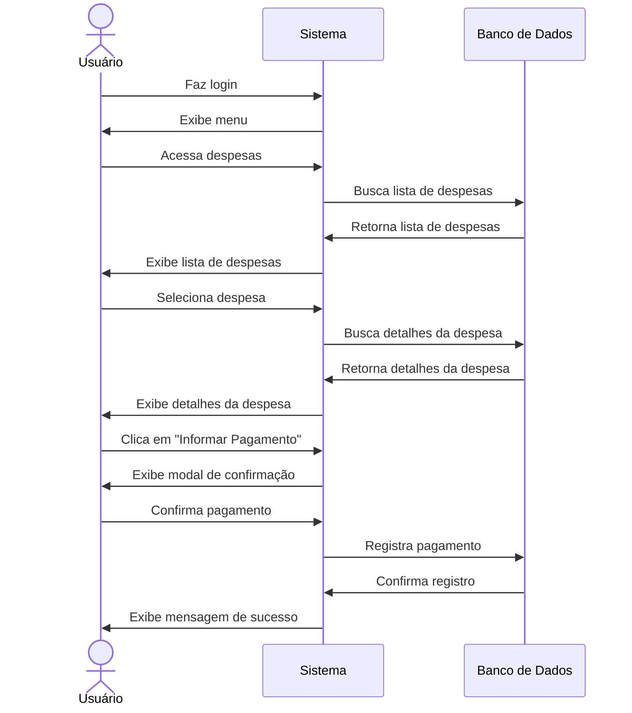

# 💰 RF22 - Informar Pagamento 

{ width=150 }

## 📝 Descrição

O sistema deve permitir que o usuário informe que o pagamento de uma despesa foi realizado.

## 👥 Atores

- 👤 Usuário
- 👥 Colaborador

## ⚠️ Pré-condições

- O usuário deve estar autenticado no sistema.
- A despesa deve existir no sistema.
- O usuário deve possuir permissão para informar pagamento de despesas.

## 🔌 Endpoints

- `POST /api/expense/:pkExpense/payment`

## 📋 Dados da Requisição

| Campo       | Tipo      | Obrigatório | Descrição                 | Restrições |
|-------------|-----------|-------------|---------------------------|------------|
| `token`     | `string`  | ✅ Sim      | Token jwt do usuário      |            |
| `pkExpense` | `long`    | ✅ Sim      | Chave primária da despesa |            |
| `date`      | `date`    | ❌ Não      | Data do pagamento         | Formato: YYYY-MM-DD |
| `value`     | `decimal` | ❌ Não      | Valor pago                | Deve ser maior que zero |

## 🔄 Fluxo Principal



1. O usuário faz login no sistema.
2. O usuário acessa a opção no menu de visualizar despesas.
3. O sistema exibe a lista de despesas.
4. O usuário clica na despesa que deseja informar pagamento.
5. O sistema exibe as informações da despesa.
6. O usuário clica no botão de informar pagamento.
7. O sistema exibe um modal para o usuário confirmar o pagamento.
8. O usuário confirma o pagamento.
9. O sistema exibe uma mensagem de sucesso.
10. O sistema redireciona o usuário para a página de visualização de despesas.

## 🔀 Fluxos Alternativos

### 🔄 FA01 - Pagamento Direto
1. No passo 3 do fluxo principal, o usuário clica no botão de informar pagamento direto.
2. O sistema exibe um modal para o usuário confirmar o pagamento.
3. O usuário confirma o pagamento.
4. O sistema exibe uma mensagem de sucesso.
5. O sistema redireciona o usuário para a página de visualização de despesas.

## 🚫 Fluxos de Exceção

### ⚠️ FE01 - Token inválido
1. No passo 3 do fluxo principal, se o token informado for inválido, o sistema exibe uma mensagem de erro.
2. O sistema redireciona o usuário para a página de login.

### ⚠️ FE02 - Usuário não logado
1. No passo 2 do fluxo principal, se o usuário não estiver logado, o sistema exibe uma mensagem de erro.
2. O sistema redireciona o usuário para a página de login.

### ⚠️ FE03 - Usuário sem permissão
1. No passo 2 do fluxo principal, se o usuário não possuir permissão para informar pagamento de despesas, o sistema exibe uma mensagem de erro.
2. O sistema redireciona o usuário para a página de visualização de despesas.

### ⚠️ FE04 - Despesa não encontrada
1. No passo 4 do fluxo principal, se a despesa não for encontrada, o sistema exibe uma mensagem de erro.
2. O sistema redireciona o usuário para a página de visualização de despesas.

### ⚠️ FE05 - Saldo insuficiente
1. No passo 6 do fluxo principal, se o usuário não possuir saldo suficiente para realizar o pagamento, o sistema exibe uma mensagem de erro.
2. O sistema redireciona o usuário para a página de visualização de despesas.

## 🧪 Exemplos de Uso

### Requisição HTTP
```http
POST /api/expense/789/payment HTTP/1.1
Host: api.metakyasshu.com
Authorization: Bearer {token}
Content-Type: application/json

{
  "date": "2023-06-10",
  "value": 150.75
}
```

### Resposta
```http
HTTP/1.1 200 OK
Content-Type: application/json

{
  "message": "Pagamento registrado com sucesso!",
  "expense": {
    "id": 789,
    "name": "Conta de Luz",
    "value": 150.75,
    "dateVencto": "2023-06-15",
    "datePayment": "2023-06-10",
    "status": "PAID"
  }
}
```

## 🖼️ Interface de Referência


---

> ---------------------------------------------------------------------------
> #### 💰 Sistema de Gestão Financeira 💰
> ***Controlando suas finanças de forma simples e eficiente***
> ---------------------------------------------------------------------------