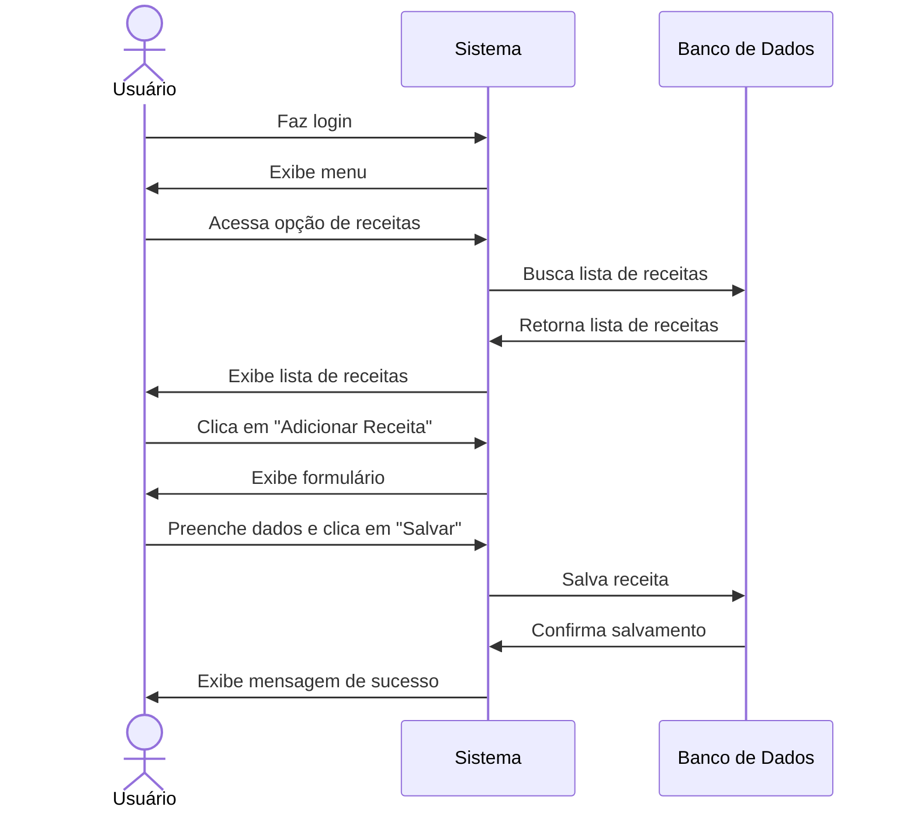

# 💰 RF24 - Adicionar Receita 

{ width=150 }

## 📝 Descrição

O sistema deve permitir que o usuário adicione uma receita.

## 👥 Atores

- 👤 Usuário

## ⚠️ Pré-condições

- O usuário deve estar autenticado no sistema.

## 🔌 Endpoints

- `POST /api/revenue`

## 📋 Dados da Requisição

| Campo         | Tipo          | Obrigatório | Descrição                              | Restrições |
|---------------|---------------|-------------|----------------------------------------|------------|
| `token`       | `string`      | ✅ Sim      | Token jwt do usuário                   |            |
| `description` | `string`      | ✅ Sim      | Descrição da receita                   | Máximo 100 caracteres |
| `value`       | `big decimal` | ✅ Sim      | Valor da receita                       | Valor > 0  |
| `date`        | `date`        | ❌ Não      | Data da receita                        | Formato: YYYY-MM-DD |
| `pkCategory`  | `long`        | ❌ Não      | Chave primária da categoria da receita |            |
| `accessLevel` | `string`      | ❌ Não      | Nível de acesso da receita             | PRIVATE, PUBLIC |

## 🔄 Fluxo Principal



1. O usuário faz login no sistema.
2. O usuário acessa a opção no menu de receita.
3. O sistema exibe a lista de receitas.
4. O usuário clica no botão de adicionar receita.
5. O sistema exibe um formulário para o usuário informar a receita.
6. O usuário informa a descrição, valor e data da receita.
7. O usuário clica no botão de salvar.
8. O sistema exibe uma mensagem de sucesso.
9. O sistema redireciona o usuário para a página de visualização de receitas.

## 🔀 Fluxos Alternativos

- Não se aplica.

## 🚫 Fluxos de Exceção

### ⚠️ FE01 - Token inválido
1. No passo 3 do fluxo principal, se o token informado for inválido, o sistema exibe uma mensagem de erro.
2. O sistema redireciona o usuário para a página de login.

### ⚠️ FE02 - Usuário não logado
1. No passo 2 do fluxo principal, se o usuário não estiver logado, o sistema exibe uma mensagem de erro.
2. O sistema redireciona o usuário para a página de login.

### ⚠️ FE03 - Valor inválido
1. No passo 6 do fluxo principal, se o valor informado for inválido, o sistema exibe uma mensagem de erro.
2. O sistema mantém o usuário na página de adição de receita.

## 🧪 Exemplos de Uso

### Requisição HTTP
```http
POST /api/revenue HTTP/1.1
Host: api.metakyasshu.com
Authorization: Bearer {token}
Content-Type: application/json

{
  "description": "Salário mensal",
  "value": 5000.00,
  "date": "2023-06-05",
  "pkCategory": 3,
  "accessLevel": "PRIVATE"
}
```

### Resposta
```http
HTTP/1.1 201 Created
Content-Type: application/json

{
  "message": "Receita adicionada com sucesso!",
  "revenue": {
    "id": 123,
    "description": "Salário mensal",
    "value": 5000.00,
    "date": "2023-06-05",
    "category": {
      "id": 3,
      "name": "Salário",
      "group": "RECEITA"
    },
    "accessLevel": "PRIVATE",
    "createdAt": "2023-06-05T14:30:45Z",
    "updatedAt": "2023-06-05T14:30:45Z"
  }
}
```


> ---------------------------------------------------------------------------
> #### 💰 Sistema de Gestão Financeira 💰
> ***Controlando suas finanças de forma simples e eficiente***
> ---------------------------------------------------------------------------