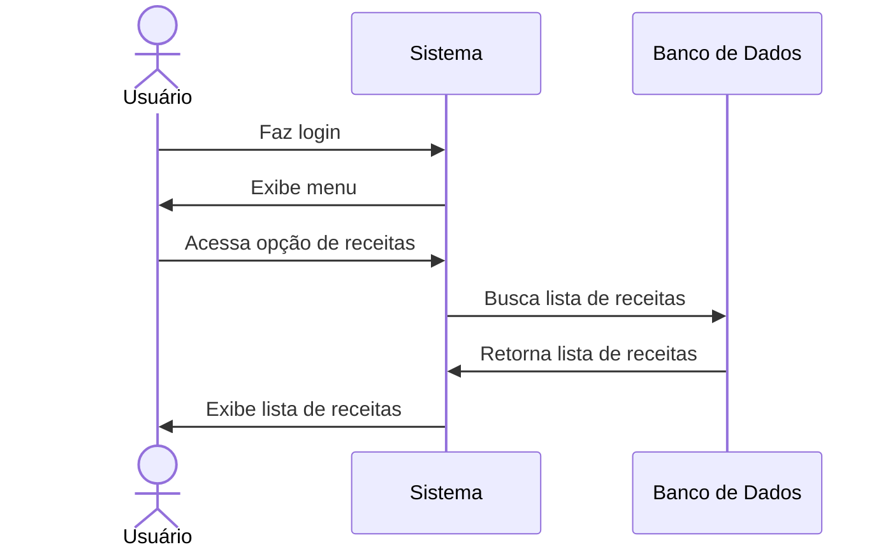

# 💰 RF25 - Listar Receitas 

{ width=150 }

## 📝 Descrição

O sistema deve permitir que o usuário visualize uma lista de receitas.

## 👥 Atores

- 👤 Usuário

## ⚠️ Pré-condições

- O usuário deve estar autenticado no sistema.

## 🔌 Endpoints

- `GET /api/revenue`

## 📋 Dados da Requisição

| Campo        | Tipo     | Obrigatório | Descrição               | Restrições |
|--------------|----------|-------------|-------------------------|------------|
| `token`      | `string` | ✅ Sim      | Token jwt do usuário    |            |
| `description`| `string` | ❌ Não      | Descrição da receita    |            |
| `category`   | `string` | ❌ Não      | Categoria da receita    |            |
| `date_init`  | `date`   | ❌ Não      | Data inicial da receita | Formato: YYYY-MM-DD |
| `date_final` | `date`   | ❌ Não      | Data final da receita   | Formato: YYYY-MM-DD |
| `min_value`  | `decimal`| ❌ Não      | Valor mínimo            | Deve ser maior que zero |
| `max_value`  | `decimal`| ❌ Não      | Valor máximo            | Deve ser maior que zero |

## 🔄 Fluxo Principal



1. O usuário faz login no sistema.
2. O usuário acessa a opção no menu de receitas.
3. O sistema exibe a lista de receitas.

## 🔀 Fluxos Alternativos

### 🔍 FA01 - Filtrar
1. No passo 3 do fluxo principal, o usuário informa os filtros desejados.
2. O sistema exibe a lista de receitas filtrada.

## 🚫 Fluxos de Exceção

### ⚠️ FE01 - Token inválido
1. No passo 3 do fluxo principal, se o token informado for inválido, o sistema exibe uma mensagem de erro.
2. O sistema redireciona o usuário para a página de login.

### ⚠️ FE02 - Usuário não logado
1. No passo 2 do fluxo principal, se o usuário não estiver logado, o sistema exibe uma mensagem de erro.
2. O sistema redireciona o usuário para a página de login.

## 🧪 Exemplos de Uso

### Requisição HTTP
```http
GET /api/revenue?category=Salário&date_init=2023-06-01&date_final=2023-06-30 HTTP/1.1
Host: api.metakyasshu.com
Authorization: Bearer {token}
```

### Resposta
```http
HTTP/1.1 200 OK
Content-Type: application/json

{
  "total": 3,
  "totalValue": 15000.00,
  "items": [
    {
      "id": 123,
      "description": "Salário mensal",
      "value": 5000.00,
      "date": "2023-06-05",
      "category": {
        "id": 3,
        "name": "Salário",
        "group": "RECEITA"
      }
    },
    {
      "id": 124,
      "description": "Freelance projeto web",
      "value": 7000.00,
      "date": "2023-06-15",
      "category": {
        "id": 3,
        "name": "Salário",
        "group": "RECEITA"
      }
    },
    {
      "id": 125,
      "description": "Bônus trimestral",
      "value": 3000.00,
      "date": "2023-06-30",
      "category": {
        "id": 3,
        "name": "Salário",
        "group": "RECEITA"
      }
    }
  ]
}
```


> ---------------------------------------------------------------------------
> #### 💰 Sistema de Gestão Financeira 💰
> ***Controlando suas finanças de forma simples e eficiente***
> ---------------------------------------------------------------------------