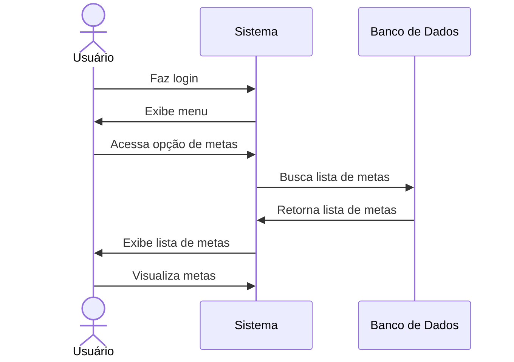

# 🎯 RF27 - Listar Metas 

{ width=150 }

## 📝 Descrição

O sistema deve permitir que o usuário possa listar as metas cadastradas no sistema.

## 👥 Atores

- 👤 Usuário
- 👥 Colaborador

## ⚠️ Pré-condições

- O usuário deve estar autenticado no sistema.
- O colaborador deve estar autenticado no sistema.
- O usuário deve ter compartilhado a meta com o colaborador.

## 🔌 Endpoints

- `GET /api/goal`

## 📋 Dados da Requisição

| Campo           | Tipo     | Obrigatório | Descrição                       | Restrições |
|-----------------|----------|-------------|---------------------------------|------------|
| `token`         | `string` | ✅ Sim      | Token jwt do usuário            |            |
| `name`          | `string` | ❌ Não      | Nome da meta                    |            |
| `category`      | `string` | ❌ Não      | Categoria da meta               |            |
| `date_init`     | `date`   | ❌ Não      | Data inicial                    | Formato: YYYY-MM-DD |
| `date_final`    | `date`   | ❌ Não      | Data final                      | Formato: YYYY-MM-DD |
| `status`        | `enum`   | ❌ Não      | Status da meta                  | PENDING, COMPLETED, EXPIRED |
| `access_level`  | `enum`   | ❌ Não      | Nível de acesso                 | PRIVATE, PUBLIC |
| `availability`  | `enum`   | ❌ Não      | Disponibilidade da meta         | AVAILABLE, UNAVAILABLE |

## 🔄 Fluxo Principal



1. O usuário faz login no sistema.
2. O usuário acessa a opção no menu de metas.
3. O sistema exibe a lista de metas.
4. O usuário visualiza as metas cadastradas.

## 🔀 Fluxos Alternativos

### 🔍 FA01 - Filtrar metas
1. O usuário faz login no sistema.
2. O usuário acessa a opção no menu de metas.
3. O sistema exibe a lista de metas.
4. O usuário preenche os campos de filtro.
5. O sistema exibe a lista de metas filtrada.

## 🚫 Fluxos de Exceção

- Não se aplica

## 🧪 Exemplos de Uso

### Requisição HTTP
```http
GET /api/goal?category=Viagem&status=PENDING HTTP/1.1
Host: api.metakyasshu.com
Authorization: Bearer {token}
```

### Resposta
```http
HTTP/1.1 200 OK
Content-Type: application/json

{
  "total": 2,
  "items": [
    {
      "id": 42,
      "name": "Juntar para viagem",
      "description": "Economia para viagem de férias",
      "value": 5000.00,
      "current_value": 2500.00,
      "percentage": 50,
      "date_vencto": "2023-12-15",
      "status": "PENDING",
      "category": {
        "id": 5,
        "name": "Viagem",
        "group": "META"
      }
    },
    {
      "id": 43,
      "name": "Viagem para Europa",
      "description": "Economia para viagem internacional",
      "value": 15000.00,
      "current_value": 3000.00,
      "percentage": 20,
      "date_vencto": "2024-07-20",
      "status": "PENDING",
      "category": {
        "id": 5,
        "name": "Viagem",
        "group": "META"
      }
    }
  ]
}
```

> ---------------------------------------------------------------------------
> #### 💰 Sistema de Gestão Financeira 💰
> ***Controlando suas finanças de forma simples e eficiente***
> ---------------------------------------------------------------------------
