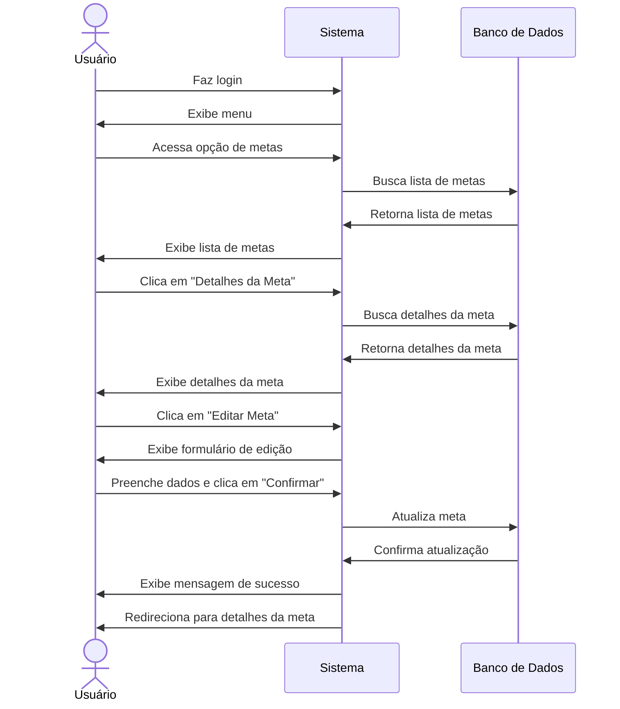

# 🎯 RF28 - Editar Meta 

{ width=150 }

## 📝 Descrição

Este requisito é responsável por permitir que o usuário edite uma meta já cadastrada no sistema.

## 👥 Atores

- 👤 Usuário

## ⚠️ Pré-condições

- O usuário deve estar autenticado no sistema.
- A meta deve estar cadastrada no sistema.
- A meta deve pertencer ao usuário autenticado.

## 🔌 Endpoints

- `PUT /api/goal/:pkGoal`

## 📋 Dados da Requisição

| Campo          | Tipo          | Obrigatório | Descrição            | Restrições             |
|----------------|---------------|-------------|----------------------|------------------------|
| `token`        | `string`      | ✅ Sim      | Token jwt do usuário |                        |
| `name`         | `string`      | ✅ Sim      | Nome da meta         | Máximo 100 caracteres  |
| `description`  | `string`      | ❌ Não      | Descrição da meta    | Máximo 500 caracteres  |
| `value`        | `big decimal` | ❌ Não      | Valor da meta        | Maior que 0            |
| `date_vencto`  | `date`        | ❌ Não      | Data de vencimento   | Maior que a data atual |
| `pkCategory`   | `long`        | ✅ Sim      | Categoria da meta    |                        |
| `access_level` | `enum`        | ❌ Não      | Nível de acesso      | PRIVATE, PUBLIC        |

## 🔄 Fluxo Principal



1. O usuário faz login no sistema.
2. O usuário acessa a opção no menu de metas.
3. O sistema exibe a lista de metas.
4. O usuário clica no botão de detalhes da meta.
5. O sistema exibe os detalhes da meta.
6. O usuário clica no botão de editar meta.
7. O sistema exibe um formulário para editar a meta.
8. O usuário preenche os campos do formulário.
9. O usuário clica no botão de confirmar edição.
10. O sistema valida os campos.
11. O sistema edita a meta.
12. O usuário é redirecionado para a página de detalhes da meta.

## 🔀 Fluxos Alternativos

### 🔙 FA01 - Cancelar edição
1. O usuário faz login no sistema.
2. O usuário acessa a opção no menu de metas.
3. O sistema exibe a lista de metas.
4. O usuário clica no botão de detalhes da meta.
5. O sistema exibe os detalhes da meta.
6. O usuário clica no botão de editar meta.
7. O sistema exibe um formulário para editar a meta.
8. O usuário clica no botão de cancelar edição.
9. O usuário é redirecionado para a página de detalhes da meta.

## 🚫 Fluxos de Exceção

### ⚠️ FE01 - Meta não encontrada
1. No passo 4 do Fluxo Principal, se a meta não for encontrada, o sistema exibe uma mensagem de erro.
2. O sistema redireciona o usuário para a página de metas.

### ⚠️ FE02 - Campos obrigatórios não preenchidos
1. No passo 9 do Fluxo Principal, se algum campo obrigatório não for preenchido, o sistema exibe uma mensagem de erro.
2. O sistema mantém o usuário no formulário de edição da meta.

### ⚠️ FE03 - Valor da meta inválido
1. No passo 9 do Fluxo Principal, se o valor da meta for inválido, o sistema exibe uma mensagem de erro.
2. O sistema mantém o usuário no formulário de edição da meta.

### ⚠️ FE04 - Data de vencimento inválida
1. No passo 9 do Fluxo Principal, se a data de vencimento for inválida, o sistema exibe uma mensagem de erro.
2. O sistema mantém o usuário no formulário de edição da meta.

## 🧪 Exemplos de Uso

### Requisição HTTP
```http
PUT /api/goal/42 HTTP/1.1
Host: api.metakyasshu.com
Authorization: Bearer {token}
Content-Type: application/json

{
  "name": "Viagem para praia",
  "description": "Economia para viagem de férias na praia",
  "value": 6000.00,
  "date_vencto": "2023-12-20",
  "pkCategory": 5,
  "access_level": "PRIVATE"
}
```

### Resposta
```http
HTTP/1.1 200 OK
Content-Type: application/json

{
  "message": "Meta atualizada com sucesso!",
  "goal": {
    "id": 42,
    "name": "Viagem para praia",
    "description": "Economia para viagem de férias na praia",
    "value": 6000.00,
    "current_value": 2500.00,
    "percentage": 41.67,
    "date_vencto": "2023-12-20",
    "category": {
      "id": 5,
      "name": "Viagem",
      "group": "META"
    },
    "access_level": "PRIVATE",
    "createdAt": "2023-06-10T10:30:45Z",
    "updatedAt": "2023-06-15T14:25:30Z"
  }
}
```


> ---------------------------------------------------------------------------
> #### 💰 Sistema de Gestão Financeira 💰
> ***Controlando suas finanças de forma simples e eficiente***
> ---------------------------------------------------------------------------