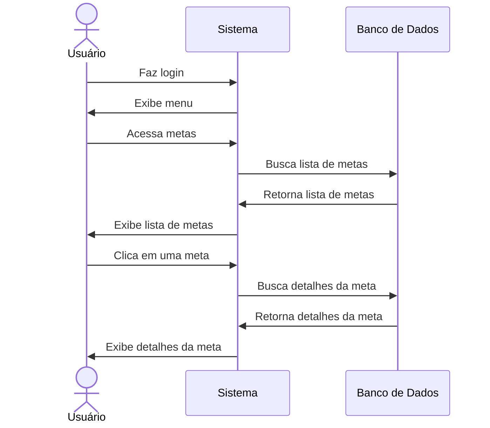

# 🎯 RF29 - Visualizar Meta 

{ width=150 }

## 📝 Descrição

O sistema deve permitir que o usuário visualize uma meta.

## 👥 Atores

- 👤 Usuário
- 👥 Colaborador

## ⚠️ Pré-condições

- O usuário deve estar autenticado no sistema.
- O usuário deve possuir permissão para visualizar metas.
- A meta deve existir no sistema.

## 🔌 Endpoints

- `GET /api/goal/:pkGoal`

## 📋 Dados da Requisição

| Campo    | Tipo      | Obrigatório | Descrição              | Restrições |
|----------|-----------|-------------|------------------------|------------|
| `token`  | `string`  | ✅ Sim      | Token jwt do usuário   |            |
| `pkGoal` | `long`    | ✅ Sim      | Chave primária da meta |            |

## 🔄 Fluxo Principal



1. O usuário faz login no sistema.
2. O usuário acessa a opção no menu de visualizar metas.
3. O sistema exibe a lista de metas.
4. O usuário clica na meta que deseja visualizar.
5. O sistema exibe as informações da meta.

## 🔀 Fluxos Alternativos

- Não se aplica.

## 🚫 Fluxos de Exceção

### ⚠️ FE01 - Token inválido
1. No passo 3 do fluxo principal, se o token informado for inválido, o sistema exibe uma mensagem de erro.
2. O sistema redireciona o usuário para a página de login.

### ⚠️ FE02 - Usuário não logado
1. No passo 2 do fluxo principal, se o usuário não estiver logado, o sistema exibe uma mensagem de erro.
2. O sistema redireciona o usuário para a página de login.

### ⚠️ FE03 - Usuário sem permissão
1. No passo 2 do fluxo principal, se o usuário não possuir permissão para visualizar metas, o sistema exibe uma mensagem de erro.
2. O sistema redireciona o usuário para a página de visualização de metas.

### ⚠️ FE04 - Meta não encontrada
1. No passo 4 do fluxo principal, se a meta não for encontrada, o sistema exibe uma mensagem de erro.
2. O sistema redireciona o usuário para a página de visualização de metas.

## 🧪 Exemplos de Uso

### Requisição HTTP
```http
GET /api/goal/42 HTTP/1.1
Host: api.metakyasshu.com
Authorization: Bearer {token}
```

### Resposta
```http
HTTP/1.1 200 OK
Content-Type: application/json

{
  "id": 42,
  "name": "Viagem para praia",
  "description": "Economia para viagem de férias na praia",
  "value": 6000.00,
  "current_value": 2500.00,
  "percentage": 41.67,
  "date_vencto": "2023-12-20",
  "status": "PENDING",
  "category": {
    "id": 5,
    "name": "Viagem",
    "group": "META"
  },
  "access_level": "PRIVATE",
  "createdAt": "2023-06-10T10:30:45Z",
  "updatedAt": "2023-06-15T14:25:30Z"
}
```

> ---------------------------------------------------------------------------
> #### 💰 Sistema de Gestão Financeira 💰
> ***Controlando suas finanças de forma simples e eficiente***
> ---------------------------------------------------------------------------
