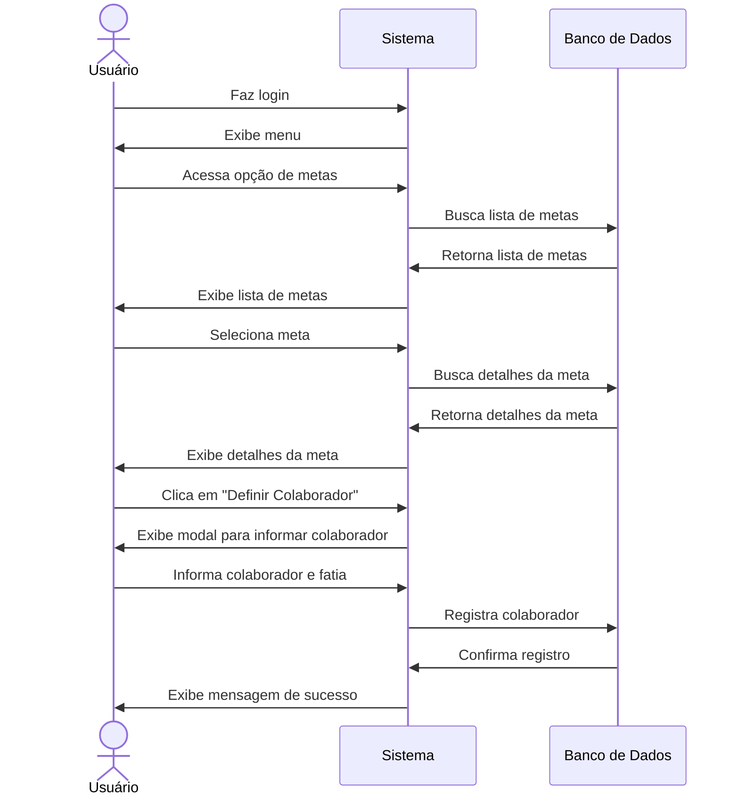

# 👥 RF30 - Definir Colaborador para Meta 

{ width=150 }

## 📝 Descrição

O sistema deve permitir que o usuário defina um colaborador para uma meta.

## 👥 Atores

- 👤 Usuário

## ⚠️ Pré-condições

- O usuário deve estar autenticado no sistema.
- A meta deve existir no sistema.

## 🔌 Endpoints

- `POST /api/goal/:pkGoal/associate`

## 📋 Dados da Requisição

| Campo     | Tipo          | Obrigatório | Descrição                          | Restrições             |
|-----------|---------------|-------------|------------------------------------|------------------------|
| `token`   | `string`      | ✅ Sim      | Token jwt do usuário               |                        |
| `pkGoal`  | `long`        | ✅ Sim      | Chave primária da meta             |                        |
| `pkUser`  | `long`        | ✅ Sim      | Chave primária do usuário          |                        |
| `value`   | `big decimal` | ❌ Não      | Valor da fatia do colaborador      | Deve ser maior que zero |
| `percent` | `decimal`     | ❌ Não      | Percentual da fatia do colaborador | Entre 0 e 100         |

## 🔄 Fluxo Principal



1. O usuário faz login no sistema.
2. O usuário acessa a opção no menu de visualizar metas.
3. O sistema exibe a lista de metas.
4. O usuário clica na meta que deseja definir colaborador.
5. O sistema exibe as informações da meta.
6. O usuário clica no botão de definir colaborador.
7. O sistema exibe um modal para o usuário informar o colaborador.
8. O usuário informa o colaborador e a fatia.
9. O sistema exibe uma mensagem de sucesso.
10. O sistema redireciona o usuário para a página de visualização de metas.

## 🔀 Fluxos Alternativos

- Não se aplica.

## 🚫 Fluxos de Exceção

### ⚠️ FE01 - Token inválido
1. No passo 3 do fluxo principal, se o token informado for inválido, o sistema exibe uma mensagem de erro.
2. O sistema redireciona o usuário para a página de login.

### ⚠️ FE02 - Usuário não logado
1. No passo 2 do fluxo principal, se o usuário não estiver logado, o sistema exibe uma mensagem de erro.
2. O sistema redireciona o usuário para a página de login.

### ⚠️ FE03 - Meta não encontrada
1. No passo 4 do fluxo principal, se a meta não for encontrada, o sistema exibe uma mensagem de erro.
2. O sistema redireciona o usuário para a página de visualização de metas.

### ⚠️ FE04 - Colaborador não encontrado
1. No passo 8 do fluxo principal, se o colaborador não for encontrado, o sistema exibe uma mensagem de erro.
2. O sistema redireciona o usuário para a página de visualização de metas.

### ⚠️ FE05 - Valor inválido
1. No passo 8 do fluxo principal, se o valor informado for inválido, o sistema exibe uma mensagem de erro.
2. O sistema redireciona o usuário para a página de visualização de metas.

### ⚠️ FE06 - Percentual inválido
1. No passo 8 do fluxo principal, se o percentual informado for inválido, o sistema exibe uma mensagem de erro.
2. O sistema redireciona o usuário para a página de visualização de metas.

## 🧪 Exemplos de Uso

### Requisição HTTP
```http
POST /api/goal/42/associate HTTP/1.1
Host: api.metakyasshu.com
Authorization: Bearer {token}
Content-Type: application/json

{
  "pkUser": 789,
  "percent": 30
}
```

### Resposta
```http
HTTP/1.1 200 OK
Content-Type: application/json

{
  "message": "Colaborador definido com sucesso!",
  "goal": {
    "id": 42,
    "name": "Viagem para praia",
    "value": 6000.00,
    "collaborators": [
      {
        "userId": 789,
        "name": "Carlos Oliveira",
        "email": "carlos@email.com",
        "percent": 30,
        "value": 1800.00
      }
    ]
  }
}
```

> ---------------------------------------------------------------------------
> #### 💰 Sistema de Gestão Financeira 💰
> ***Controlando suas finanças de forma simples e eficiente***
> ---------------------------------------------------------------------------