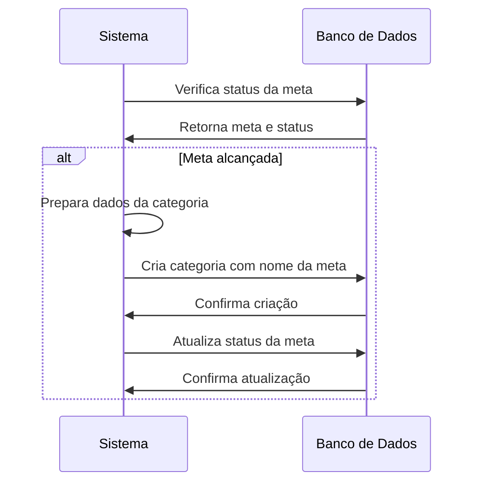

# 🏷️ RF31 - Criar Categoria para Meta Alcançada 

{ width=150 }

## 📝 Descrição

Quando o usuário alcançar uma meta, o sistema criará uma categoria para a meta alcançada.

## 👥 Atores

- 🤖 Sistema

## ⚠️ Pré-condições

- A meta deve existir no sistema.
- A meta deve ter sido alcançada.

## 🔌 Endpoints

- Não se aplica. (Processo interno do sistema)

## 📋 Dados do Processamento

| Campo    | Tipo     | Obrigatório | Descrição              | Restrições                    |
|----------|----------|-------------|------------------------|-------------------------------|
| `pkGoal` | `long`   | ✅ Sim      | Chave primária da meta |                               |
| `name`   | `string` | ✅ Sim      | Nome da categoria      | Mínimo de 3 caracteres        |
| `group`  | `enum`   | ✅ Sim      | Grupo da categoria     | META                          |
| `icon`   | `file`   | ❌ Não      | Ícone da categoria     | JPEG, PNG, SVG, Máximo de 1MB |
| `token`  | `string` | ✅ Sim      | Token jwt do usuário   |                               |

## 🔄 Fluxo Principal



1. O sistema verifica se a meta foi alcançada.
2. O sistema cria uma categoria para a meta alcançada.
3. O sistema vincula a categoria ao usuário dono da meta.
4. O sistema atualiza o status da meta para "COMPLETED".

## 🔀 Fluxos Alternativos

- Não se aplica.

## 🚫 Fluxos de Exceção

- Não se aplica.

## 🧪 Exemplos de Uso

Como esse é um processo interno do sistema, não há exemplos de requisições HTTP, mas podemos ilustrar o funcionamento interno:

### Evento Interno
```
GOAL_REACHED_EVENT:
{
  "goalId": 42,
  "userId": 123,
  "goalName": "Viagem para praia",
  "currentValue": 6000.00,
  "targetValue": 6000.00,
  "percentage": 100
}
```

### Ação do Sistema
```
CREATE_CATEGORY:
{
  "name": "Viagem para praia",
  "group": "META",
  "userId": 123,
  "icon": "default_goal_icon.png"
}
```

### Resposta do Sistema (Log interno)
```
INFO: Meta ID 42 alcançada (100%). Categoria "Viagem para praia" criada com ID 78 para o usuário 123.
```


> ---------------------------------------------------------------------------
> #### 💰 Sistema de Gestão Financeira 💰
> ***Controlando suas finanças de forma simples e eficiente***
> ---------------------------------------------------------------------------