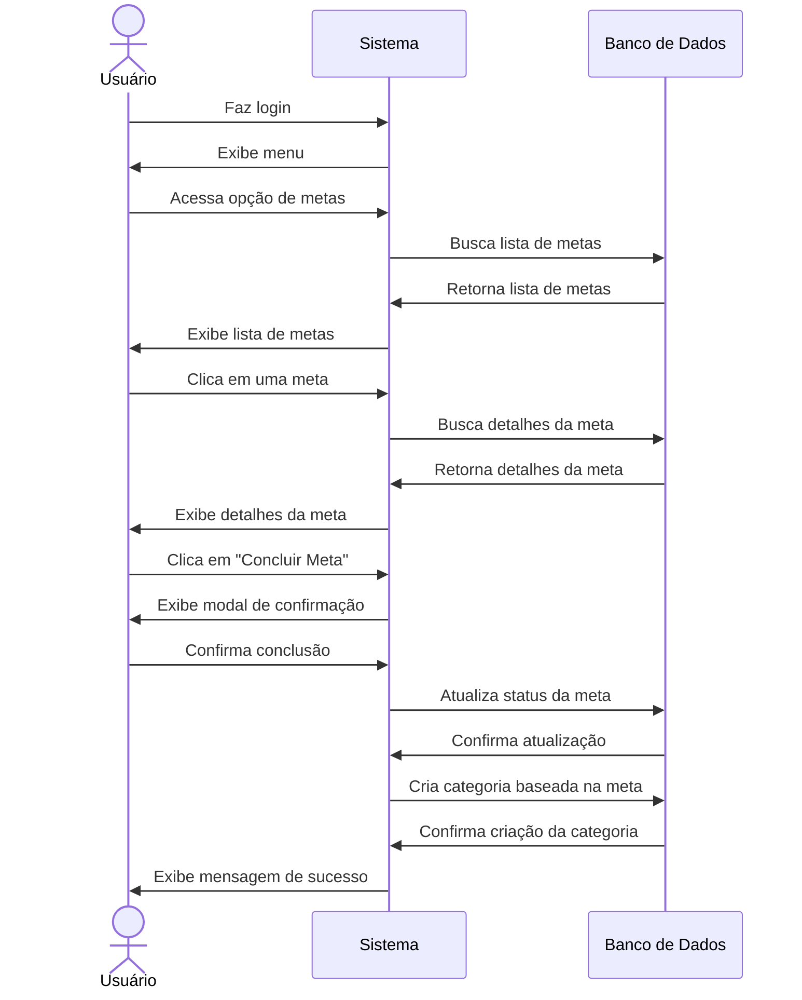

# 🎯 RF32 - Concluir Meta 

{ width=150 }

## 📝 Descrição

O sistema deve permitir que o usuário informe que a meta foi consumada.

## 👥 Atores

- 👤 Usuário
- 👥 Colaborador

## ⚠️ Pré-condições

- O usuário deve estar autenticado no sistema.
- A meta deve existir no sistema.
- O usuário deve possuir permissão para informar consumação de metas.

## 🔌 Endpoints

- `POST /api/goal/:pkGoal/consummated`

## 📋 Dados da Requisição

| Campo    | Tipo      | Obrigatório | Descrição              | Restrições |
|----------|-----------|-------------|------------------------|------------|
| `token`  | `string`  | ✅ Sim      | Token jwt do usuário   |            |
| `pkGoal` | `long`    | ✅ Sim      | Chave primária da meta |            |

## 🔄 Fluxo Principal



1. O usuário faz login no sistema.
2. O usuário acessa a opção no menu de visualizar metas.
3. O sistema exibe a lista de metas.
4. O usuário clica na meta que deseja informar consumação.
5. O sistema exibe as informações da meta.
6. O usuário clica no botão de informar consumação.
7. O sistema exibe um modal para o usuário confirmar a consumação da meta.
8. O usuário confirma a consumação da meta.
9. O sistema atualiza o status da meta para "COMPLETED".
10. O sistema cria uma categoria baseada na meta concluída.
11. O sistema exibe uma mensagem de sucesso.
12. O sistema redireciona o usuário para a página de visualização de metas.

## 🔀 Fluxos Alternativos

### 🔄 FA01 - Consumação Direta
1. No passo 3 do fluxo principal, o usuário clica no botão de informar consumação diretamente.
2. O sistema exibe um modal para o usuário confirmar a consumação.
3. O usuário confirma a consumação.
4. O sistema atualiza o status da meta para "COMPLETED".
5. O sistema cria uma categoria baseada na meta concluída.
6. O sistema exibe uma mensagem de sucesso.
7. O sistema redireciona o usuário para a página de visualização de metas.

## 🚫 Fluxos de Exceção

### ⚠️ FE01 - Token inválido
1. No passo 3 do fluxo principal, se o token informado for inválido, o sistema exibe uma mensagem de erro.
2. O sistema redireciona o usuário para a página de login.

### ⚠️ FE02 - Usuário não logado
1. No passo 2 do fluxo principal, se o usuário não estiver logado, o sistema exibe uma mensagem de erro.
2. O sistema redireciona o usuário para a página de login.

### ⚠️ FE03 - Usuário sem permissão
1. No passo 2 do fluxo principal, se o usuário não possuir permissão para informar consumação de metas, o sistema exibe uma mensagem de erro.
2. O sistema redireciona o usuário para a página de visualização de metas.

### ⚠️ FE04 - Meta não encontrada
1. No passo 4 do fluxo principal, se a meta não for encontrada, o sistema exibe uma mensagem de erro.
2. O sistema redireciona o usuário para a página de visualização de metas.

### ⚠️ FE05 - Histórico de despesas não encontrado
1. No passo 8 do fluxo principal, se não houver histórico de despesas associado à meta, o sistema exibe uma mensagem de erro.
2. O sistema redireciona o usuário para a página de visualização de metas.

## 🧪 Exemplos de Uso

### Requisição HTTP
```http
POST /api/goal/42/consummated HTTP/1.1
Host: api.metakyasshu.com
Authorization: Bearer {token}
Content-Type: application/json
```

### Resposta
```http
HTTP/1.1 200 OK
Content-Type: application/json

{
  "message": "Meta concluída com sucesso!",
  "goal": {
    "id": 42,
    "name": "Viagem para praia",
    "status": "COMPLETED",
    "createdCategory": {
      "id": 78,
      "name": "Viagem para praia",
      "group": "META"
    },
    "completedDate": "2023-07-15T10:25:30Z"
  }
}
```


> ---------------------------------------------------------------------------
> #### 💰 Sistema de Gestão Financeira 💰
> ***Controlando suas finanças de forma simples e eficiente***
> ---------------------------------------------------------------------------