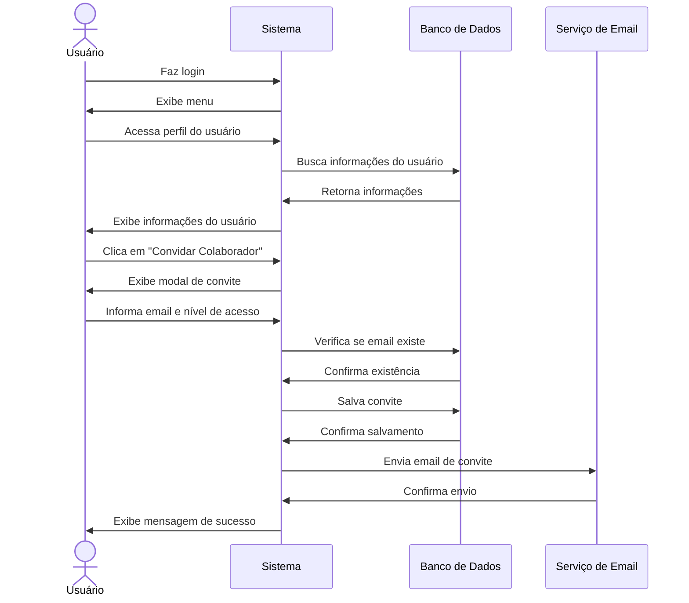

# 👥 RF33 - Convidar Colaborador 

{ width=150 }

## 📝 Descrição

O sistema deve permitir que o usuário convide outros usuários para colaborar em despesas ou metas.

## 👥 Atores

- 👤 Usuário

## ⚠️ Pré-condições

- O usuário deve estar logado no sistema.
- O convidado deve ter uma conta no sistema.

## 🔌 Endpoints

- `POST /api/invite`

## 📋 Dados da Requisição

| Campo           | Tipo     | Obrigatório | Descrição            | Restrições                    |
|-----------------|----------|-------------|----------------------|-------------------------------|
| `token`         | `string` | ✅ Sim      | Token jwt do usuário |                               |
| `email`         | `string` | ✅ Sim      | Email do convidado   | Formato de email válido       |
| `access_level`  | `enum`   | ✅ Sim      | Nível de acesso      | VIEWER, EDITOR, ADMINISTRATOR |

## 🔄 Fluxo Principal



1. O usuário faz login no sistema.
2. O usuário acessa a opção no menu de visualizar informações do usuário.
3. O sistema exibe as informações do usuário.
4. O usuário clica no botão de convidar colaborador.
5. O sistema exibe um modal para o usuário informar o email do convidado.
6. O usuário informa o email e o nível de acesso.
7. O sistema verifica se o email corresponde a um usuário cadastrado.
8. O sistema envia um convite para o convidado.
9. O sistema exibe uma mensagem de sucesso.
10. O sistema redireciona o usuário para a página de visualização de informações do usuário.

## 🔀 Fluxos Alternativos

### 🔙 FA01 - Cancelar convite
1. No passo 5 do fluxo principal, o usuário clica no botão de cancelar.
2. O sistema fecha o modal.

### 🔄 FA02 - Redirecionar convite
1. Após o passo 3 do fluxo principal, uma das informações mostrada é a lista de usuários ao qual você é colaborador.
2. O usuário clica no botão de convidar colaborador ao lado de um usuário da lista.
3. O sistema exibe um modal pré-preenchido com o email do usuário selecionado.
4. O usuário seleciona o nível de acesso.
5. O sistema envia um convite para o convidado.
6. O sistema exibe uma mensagem de sucesso.

## 🚫 Fluxos de Exceção

### ⚠️ FE01 - Token inválido
1. No passo 3 do fluxo principal, se o token informado for inválido, o sistema exibe uma mensagem de erro.
2. O sistema redireciona o usuário para a página de login.

### ⚠️ FE02 - Usuário não logado
1. No passo 2 do fluxo principal, se o usuário não estiver logado, o sistema exibe uma mensagem de erro.
2. O sistema redireciona o usuário para a página de login.

### ⚠️ FE03 - Email inválido
1. No passo 6 do fluxo principal, se o email informado for inválido, o sistema exibe uma mensagem de erro.
2. O sistema mantém o modal aberto e destaca o campo com erro.

### ⚠️ FE04 - Usuário não encontrado
1. No passo 7 do fluxo principal, se o usuário não for encontrado, o sistema exibe uma mensagem de erro.
2. O sistema oferece a opção de enviar um convite para cadastro no sistema.

## 🧪 Exemplos de Uso

### Requisição HTTP
```http
POST /api/invite HTTP/1.1
Host: api.metakyasshu.com
Authorization: Bearer {token}
Content-Type: application/json

{
  "email": "colaborador@email.com",
  "access_level": "EDITOR"
}
```

### Resposta
```http
HTTP/1.1 200 OK
Content-Type: application/json

{
  "message": "Convite enviado com sucesso!",
  "invite": {
    "id": 123,
    "email": "colaborador@email.com",
    "status": "PENDING",
    "access_level": "EDITOR",
    "created_at": "2023-07-10T15:30:45Z",
    "expires_at": "2023-07-17T15:30:45Z"
  }
}
```

> ---------------------------------------------------------------------------
> #### 💰 Sistema de Gestão Financeira 💰
> ***Controlando suas finanças de forma simples e eficiente***
> ---------------------------------------------------------------------------