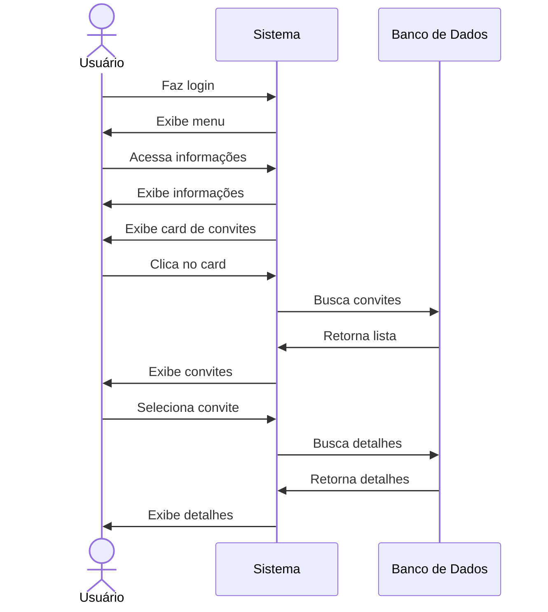

# 👁️ RF35 - Visualizar Convite 

{ width=150 }

## 📝 Descrição

Esta funcionalidade permite que usuários visualizem um convite recebido.

## 👥 Atores

- 👤 Usuário

## ⚠️ Pré-condições

- O usuário deve estar logado no sistema.
- O usuário deve possuir convites pendentes.

## 🔌 Endpoints

- `GET /api/invite/:pkInvite`

## 📋 Dados

| Campo      | Tipo      | Obrigatório | Descrição                 | Restrições |
|------------|-----------|-------------|---------------------------|------------|
| `token`    | `string`  | ✅ Sim      | Token jwt do usuário      |            |
| `pkInvite` | `long`    | ✅ Sim      | Chave primária do convite |            |

## 🔄 Fluxo Principal



1. O usuário faz login no sistema.
2. O usuário acessa a opção no menu de visualizar informações do usuário.
3. O sistema exibe as informações do usuário.
4. O sistema exibe um card com o número de convites pendentes.
5. O usuário clica no card de convites pendentes.
6. O sistema exibe a lista de convites pendentes.
7. O usuário clica no convite que deseja visualizar.
8. O sistema exibe as informações do convite.

## 🔀 Fluxos Alternativos

- Não se aplica.

## 🚫 Fluxos de Exceção

### ⚠️ FE01 - Token inválido
1. No passo 3 do fluxo principal, se o token informado for inválido, o sistema exibe uma mensagem de erro.
2. O sistema redireciona o usuário para a página de login.

### ⚠️ FE02 - Usuário não logado
1. No passo 2 do fluxo principal, se o usuário não estiver logado, o sistema exibe uma mensagem de erro.
2. O sistema redireciona o usuário para a página de login.

### ⚠️ FE03 - Convite não encontrado
1. No passo 7 do fluxo principal, se o convite não for encontrado, o sistema exibe uma mensagem de erro.
2. O sistema redireciona o usuário para a página de lista de convites pendentes.

### ⚠️ FE04 - Convite não pertence ao usuário
1. No passo 7 do fluxo principal, se o convite não pertencer ao usuário, o sistema exibe uma mensagem de erro.
2. O sistema redireciona o usuário para a página de lista de convites pendentes.

## 🧪 Exemplos de Uso

### Requisição HTTP
```http
GET /api/invite/1 HTTP/1.1
Host: api.metakyasshu.com
Authorization: Bearer {token}
```

### Resposta
```http
HTTP/1.1 200 OK
Content-Type: application/json

{
  "id": 1,
  "sender": {
    "id": 123,
    "name": "João Silva"
  },
  "message": "Convite para colaborar no orçamento familiar",
  "status": "PENDING",
  "created_at": "2023-07-15T10:30:00Z",
  "expires_at": "2023-07-22T10:30:00Z"
}
```

> ---------------------------------------------------------------------------
> #### 💰 Sistema de Gestão Financeira 💰
> ***Controlando suas finanças de forma simples e eficiente***
> ---------------------------------------------------------------------------