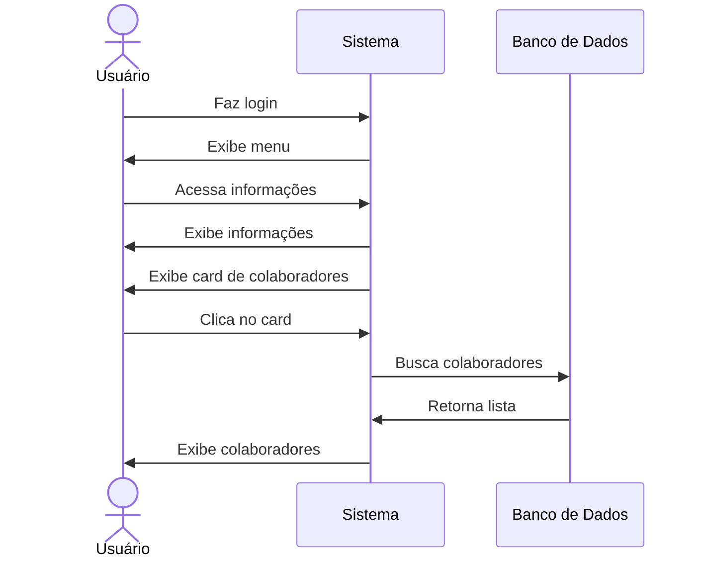

# 👥 RF37 - Listar Colaboradores 

{ width=150 }

## 📝 Descrição

Esta funcionalidade permite que usuários visualizem todos os colaboradores cadastrados no sistema.

## 👥 Atores

- 👤 Usuário

## ⚠️ Pré-condições

- O usuário deve estar logado no sistema.
- O usuário deve possuir colaboradores cadastrados.

## 🔌 Endpoints

- `GET /api/collaborator`

## 📋 Dados

| Campo   | Tipo     | Obrigatório | Descrição            | Restrições |
|---------|----------|-------------|----------------------|------------|
| `token` | `string` | ✅ Sim      | Token jwt do usuário |            |

## 🔄 Fluxo Principal



1. O usuário faz login no sistema.
2. O usuário acessa a opção no menu de visualizar informações do usuário.
3. O sistema exibe as informações do usuário.
4. O sistema exibe um card com o número de colaboradores.
5. O usuário clica no card de colaboradores.
6. O sistema exibe a lista de colaboradores.

## 🔀 Fluxos Alternativos

- Não se aplica.

## 🚫 Fluxos de Exceção

### ⚠️ FE01 - Token inválido
1. No passo 3 do fluxo principal, se o token informado for inválido, o sistema exibe uma mensagem de erro.
2. O sistema redireciona o usuário para a página de login.

### ⚠️ FE02 - Usuário não logado
1. No passo 2 do fluxo principal, se o usuário não estiver logado, o sistema exibe uma mensagem de erro.
2. O sistema redireciona o usuário para a página de login.

## 🧪 Exemplos de Uso

### Requisição HTTP
```http
GET /api/collaborator HTTP/1.1
Host: api.metakyasshu.com
Authorization: Bearer {token}
```

### Resposta
```http
HTTP/1.1 200 OK
Content-Type: application/json

{
  "total": 2,
  "items": [
    {
      "id": 1,
      "user": {
        "id": 123,
        "name": "João Silva",
        "email": "joao.silva@email.com"
      },
      "access_level": "EDITOR",
      "created_at": "2023-07-15T10:30:00Z"
    },
    {
      "id": 2,
      "user": {
        "id": 456,
        "name": "Maria Santos",
        "email": "maria.santos@email.com"
      },
      "access_level": "VIEWER",
      "created_at": "2023-07-15T11:15:00Z"
    }
  ]
}
```

> ---------------------------------------------------------------------------
> #### 💰 Sistema de Gestão Financeira 💰
> ***Controlando suas finanças de forma simples e eficiente***
> ---------------------------------------------------------------------------