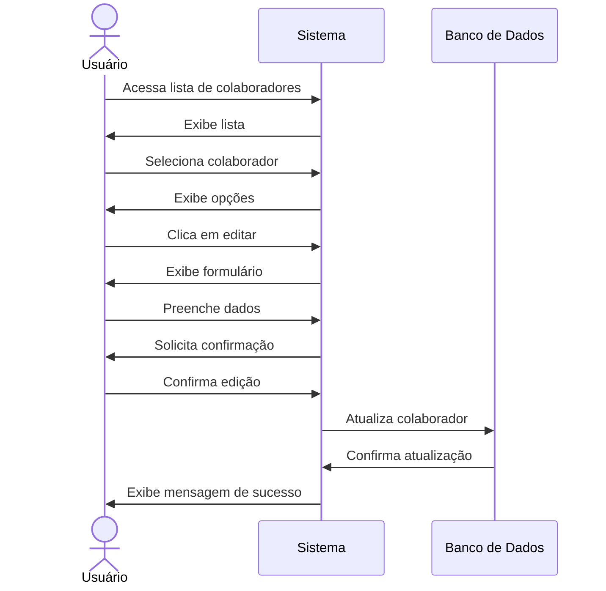

# ✏️ RF39 - Editar Colaborador 

{ width=150 }

## 📝 Descrição

Esta funcionalidade permite que usuários editem informações de colaboradores no sistema.

## 👥 Atores

- 👤 Usuário

## ⚠️ Pré-condições

- O usuário deve estar logado no sistema.
- O usuário deve possuir permissão para editar colaboradores.
- O colaborador a ser editado deve existir no sistema.

## 🔌 Endpoints

- `PUT /api/collaborator/:id`

## 📋 Dados

| Campo         | Tipo     | Obrigatório | Descrição            | Restrições |
|---------------|----------|-------------|----------------------|------------|
| `token`       | `string` | ✅ Sim      | Token jwt do usuário |            |
| `id`          | `number` | ✅ Sim      | ID do colaborador    |            |
| `access_level`| `string` | ✅ Sim      | Nível de acesso      | EDITOR, VIEWER |

## 🔄 Fluxo Principal



1. O usuário acessa a lista de colaboradores.
2. O sistema exibe a lista de colaboradores.
3. O usuário seleciona o colaborador que deseja editar.
4. O sistema exibe as opções disponíveis.
5. O usuário clica na opção de editar.
6. O sistema exibe o formulário de edição.
7. O usuário preenche os dados que deseja alterar.
8. O sistema solicita confirmação da edição.
9. O usuário confirma a edição.
10. O sistema atualiza os dados do colaborador no banco de dados.
11. O sistema exibe uma mensagem de sucesso.

## 🔀 Fluxos Alternativos

- Não se aplica.

## 🚫 Fluxos de Exceção

### ⚠️ FE01 - Token inválido
1. No passo 10 do fluxo principal, se o token informado for inválido, o sistema exibe uma mensagem de erro.
2. O sistema redireciona o usuário para a página de login.

### ⚠️ FE02 - Usuário não logado
1. No passo 1 do fluxo principal, se o usuário não estiver logado, o sistema exibe uma mensagem de erro.
2. O sistema redireciona o usuário para a página de login.

### ⚠️ FE03 - Colaborador não encontrado
1. No passo 10 do fluxo principal, se o colaborador não for encontrado, o sistema exibe uma mensagem de erro.
2. O sistema mantém o usuário na página atual.

## 🧪 Exemplos de Uso

### Requisição HTTP
```http
PUT /api/collaborator/1 HTTP/1.1
Host: api.metakyasshu.com
Authorization: Bearer {token}
Content-Type: application/json

{
  "access_level": "EDITOR"
}
```

### Resposta
```http
HTTP/1.1 200 OK
Content-Type: application/json

{
  "message": "Colaborador atualizado com sucesso",
  "data": {
    "id": 1,
    "user": {
      "id": 123,
      "name": "João Silva",
      "email": "joao.silva@email.com"
    },
    "access_level": "EDITOR",
    "created_at": "2023-07-15T10:30:00Z"
  }
}
```

> ---------------------------------------------------------------------------
> #### 💰 Sistema de Gestão Financeira 💰
> ***Controlando suas finanças de forma simples e eficiente***
> ---------------------------------------------------------------------------