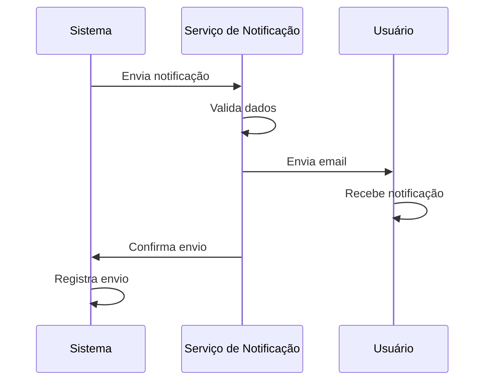

# 🔔 RF40 - Notificar Usuários 

{ width=150 }

## 📝 Descrição

Esta funcionalidade permite que o sistema envie notificações para usuários sobre eventos importantes.

## 👥 Atores

- 🤖 Sistema

## ⚠️ Pré-condições

- O usuário deve estar cadastrado no sistema.
- O usuário deve ter um email válido cadastrado.

## 🔌 Endpoints

- `POST /api/notification`

## 📋 Dados

| Campo      | Tipo     | Obrigatório | Descrição            | Restrições |
|------------|----------|-------------|----------------------|------------|
| `user_id`  | `number` | ✅ Sim      | ID do usuário        |            |
| `type`     | `string` | ✅ Sim      | Tipo de notificação  | EMAIL, PUSH |
| `title`    | `string` | ✅ Sim      | Título da mensagem   |            |
| `message`  | `string` | ✅ Sim      | Conteúdo da mensagem |            |

## 🔄 Fluxo Principal



1. O sistema identifica a necessidade de enviar uma notificação.
2. O sistema prepara os dados da notificação.
3. O sistema envia a notificação para o serviço de notificação.
4. O serviço de notificação valida os dados.
5. O serviço de notificação envia a notificação para o usuário.
6. O usuário recebe a notificação.
7. O serviço de notificação confirma o envio para o sistema.
8. O sistema registra o envio da notificação.

## 🔀 Fluxos Alternativos

### 🔄 FA01 - Notificação Push
1. No passo 5 do fluxo principal, se o tipo for PUSH, o serviço de notificação envia uma notificação push.
2. O usuário recebe a notificação no dispositivo.

## 🚫 Fluxos de Exceção

### ⚠️ FE01 - Email inválido
1. No passo 4 do fluxo principal, se o email for inválido, o serviço de notificação retorna erro.
2. O sistema registra o erro de envio.

### ⚠️ FE02 - Falha no envio
1. No passo 5 do fluxo principal, se houver falha no envio, o serviço de notificação retorna erro.
2. O sistema tenta reenviar a notificação.
3. Se após 3 tentativas ainda houver falha, o sistema registra o erro.

## 🧪 Exemplos de Uso

### Requisição HTTP
```http
POST /api/notification HTTP/1.1
Host: api.metakyasshu.com
Content-Type: application/json

{
  "user_id": 123,
  "type": "EMAIL",
  "title": "Bem-vindo ao Metakyasshu",
  "message": "Olá João, bem-vindo ao Metakyasshu! Sua conta foi criada com sucesso."
}
```

### Resposta
```http
HTTP/1.1 200 OK
Content-Type: application/json

{
  "message": "Notificação enviada com sucesso",
  "data": {
    "id": 1,
    "user_id": 123,
    "type": "EMAIL",
    "title": "Bem-vindo ao Metakyasshu",
    "message": "Olá João, bem-vindo ao Metakyasshu! Sua conta foi criada com sucesso.",
    "sent_at": "2023-07-15T10:30:00Z"
  }
}
```

> ---------------------------------------------------------------------------
> #### 💰 Sistema de Gestão Financeira 💰
> ***Controlando suas finanças de forma simples e eficiente***
> ---------------------------------------------------------------------------