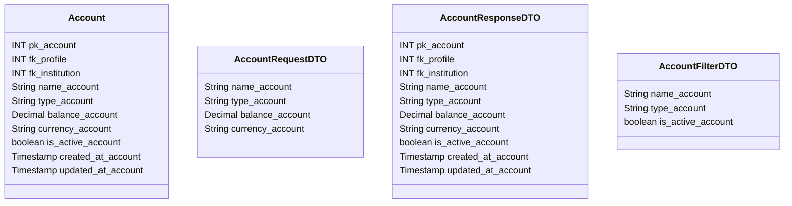

# 💰 Conta

---

## 📋 Descrição

A **Conta** representa uma conta financeira vinculada a um perfil no sistema. Pode ser uma conta bancária, carteira
digital, investimento ou qualquer outro tipo de conta que armazene ou movimente valores.

---

| Nome do Atributo   | Tipo         | Descrição              | Restrições    |
|--------------------|--------------|------------------------|---------------|
| pk_account         | INT          | Identificador único    | PRIMARY KEY   |
| fk_profile         | INT          | Perfil da conta        | FOREIGN KEY   |
| fk_institution     | INT          | Instituição financeira | FOREIGN KEY   |
| name_account       | VARCHAR(100) | Nome da conta          | NOT NULL      |
| type_account       | VARCHAR(50)  | Tipo da conta          | NOT NULL      |
| balance_account    | DECIMAL      | Saldo atual            | NOT NULL      |
| currency_account   | VARCHAR(3)   | Moeda da conta         | NOT NULL      |
| is_active_account  | BOOLEAN      | Conta ativa            | DEFAULT TRUE  |
| created_at_account | TIMESTAMP    | Data de criação        | DEFAULT NOW() |
| updated_at_account | TIMESTAMP    | Data de atualização    | DEFAULT NOW() |

---

## 📝 Descrição Detalhada

- **pk_account**: identificador único da conta no sistema. Chave primária autoincrementada.
- **fk_profile**: referência ao perfil dono da conta. Chave estrangeira para a tabela de perfis.
- **fk_institution**: referência à instituição financeira da conta. Chave estrangeira para a tabela de instituições.
- **name_account**: nome da conta financeira. Pode ser um nome personalizado para identificação.
- **type_account**: tipo da conta (ex: corrente, poupança, investimento, carteira digital).
- **balance_account**: saldo atual da conta na moeda especificada.
- **currency_account**: moeda utilizada na conta (ex: BRL, USD, EUR).
- **is_active_account**: indica se a conta está ativa no sistema.
- **created_at_account**: data e hora de criação do registro da conta.
- **updated_at_account**: data e hora da última atualização do registro da conta.

---

## 📊 Diagrama de Classes

## 🔄 Relacionamentos

* **💰 Conta**
    * ⬅️ Pertence a um perfil (N:1)
    * ⬅️ Pertence a uma instituição financeira (N:1)
    * ➡️ Múltiplas transações (1:N)
    * ➡️ Múltiplos cartões (1:N)
    * ➡️ Múltiplos pagamentos (1:N)