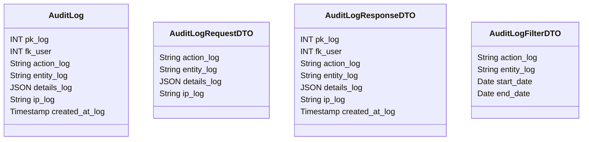

# 📝 Log de Auditoria

---

## 📋 Descrição

O **Log de Auditoria** representa um registro de todas as ações importantes realizadas no sistema, como alterações em
dados, acessos e operações críticas. Cada log contém informações detalhadas sobre quem realizou a ação, quando e o que
foi alterado.

---

| Nome do Atributo | Tipo         | Descrição           | Restrições    |
|------------------|--------------|---------------------|---------------|
| pk_log           | INT          | Identificador único | PRIMARY KEY   |
| fk_user          | INT          | Usuário da ação     | FOREIGN KEY   |
| action_log       | VARCHAR(100) | Ação realizada      | NOT NULL      |
| entity_log       | VARCHAR(50)  | Entidade afetada    | NOT NULL      |
| details_log      | JSON         | Detalhes da ação    | NOT NULL      |
| ip_log           | VARCHAR(45)  | IP do usuário       | NOT NULL      |
| created_at_log   | TIMESTAMP    | Data de criação     | DEFAULT NOW() |

---

## 📝 Descrição Detalhada

- **pk_log**: identificador único do log no sistema. Chave primária autoincrementada.
- **fk_user**: referência ao usuário que realizou a ação. Chave estrangeira para a tabela de usuários.
- **action_log**: descrição da ação realizada (ex: criar, atualizar, excluir).
- **entity_log**: nome da entidade que foi afetada pela ação.
- **details_log**: detalhes da ação em formato JSON, incluindo dados antigos e novos.
- **ip_log**: endereço IP do usuário que realizou a ação.
- **created_at_log**: data e hora em que a ação foi registrada.

---

## 📊 Diagrama de Classes

## 🔄 Relacionamentos

* **📝 Log de Auditoria**
    * ⬅️ Pertence a um usuário (N:1)
    * ➡️ Múltiplas entidades (1:N)