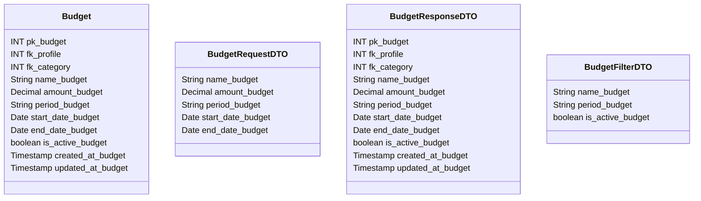

# 📊 Orçamento

---

## 📋 Descrição

O **Orçamento** representa um planejamento financeiro para uma categoria ou período específico. Cada orçamento define
limites de gastos e pode ser recorrente ou único.

---

| Nome do Atributo  | Tipo         | Descrição              | Restrições    |
|-------------------|--------------|------------------------|---------------|
| pk_budget         | INT          | Identificador único    | PRIMARY KEY   |
| fk_profile        | INT          | Perfil do orçamento    | FOREIGN KEY   |
| fk_category       | INT          | Categoria do orçamento | FOREIGN KEY   |
| name_budget       | VARCHAR(100) | Nome do orçamento      | NOT NULL      |
| amount_budget     | DECIMAL      | Valor do orçamento     | NOT NULL      |
| period_budget     | VARCHAR(20)  | Período do orçamento   | NOT NULL      |
| start_date_budget | DATE         | Data de início         | NOT NULL      |
| end_date_budget   | DATE         | Data de término        | NOT NULL      |
| is_active_budget  | BOOLEAN      | Orçamento ativo        | DEFAULT TRUE  |
| created_at_budget | TIMESTAMP    | Data de criação        | DEFAULT NOW() |
| updated_at_budget | TIMESTAMP    | Data de atualização    | DEFAULT NOW() |

---

## 📝 Descrição Detalhada

- **pk_budget**: identificador único do orçamento no sistema. Chave primária autoincrementada.
- **fk_profile**: referência ao perfil dono do orçamento. Chave estrangeira para a tabela de perfis.
- **fk_category**: referência à categoria do orçamento. Chave estrangeira para a tabela de categorias.
- **name_budget**: nome do orçamento financeiro.
- **amount_budget**: valor limite do orçamento.
- **period_budget**: período do orçamento (ex: mensal, trimestral, anual).
- **start_date_budget**: data em que o orçamento começa.
- **end_date_budget**: data em que o orçamento termina.
- **is_active_budget**: indica se o orçamento está ativo no sistema.
- **created_at_budget**: data e hora de criação do registro do orçamento.
- **updated_at_budget**: data e hora da última atualização do registro do orçamento.

---

## 📊 Diagrama de Classes

## 🔄 Relacionamentos

* **📊 Orçamento**
    * ⬅️ Pertence a um perfil (N:1)
    * ⬅️ Pertence a uma categoria (N:1)
    * ➡️ Múltiplas transações (1:N)
    * ➡️ Múltiplos alertas (1:N) 