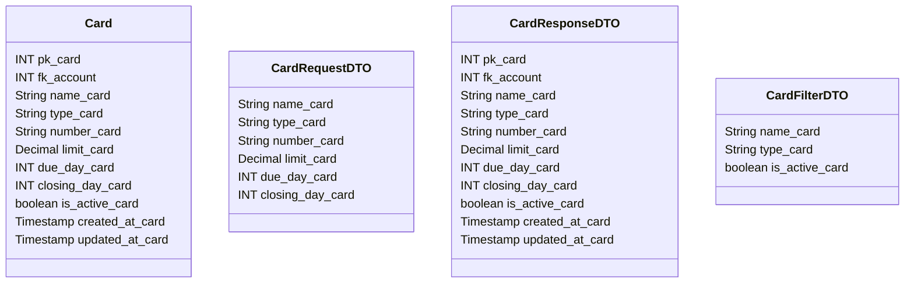

# 💳 Cartão

---

## 📋 Descrição

O **Cartão** representa um cartão de crédito, débito ou múltiplo vinculado a uma conta. Cada cartão possui suas próprias
características, limites e datas de vencimento.

---

| Nome do Atributo | Tipo         | Descrição           | Restrições    |
|------------------|--------------|---------------------|---------------|
| pk_card          | INT          | Identificador único | PRIMARY KEY   |
| fk_account       | INT          | Conta do cartão     | FOREIGN KEY   |
| name_card        | VARCHAR(100) | Nome do cartão      | NOT NULL      |
| type_card        | VARCHAR(20)  | Tipo do cartão      | NOT NULL      |
| number_card      | VARCHAR(20)  | Número do cartão    | NOT NULL      |
| limit_card       | DECIMAL      | Limite do cartão    | NOT NULL      |
| due_day_card     | INT          | Dia de vencimento   | NOT NULL      |
| closing_day_card | INT          | Dia de fechamento   | NOT NULL      |
| is_active_card   | BOOLEAN      | Cartão ativo        | DEFAULT TRUE  |
| created_at_card  | TIMESTAMP    | Data de criação     | DEFAULT NOW() |
| updated_at_card  | TIMESTAMP    | Data de atualização | DEFAULT NOW() |

---

## 📝 Descrição Detalhada

- **pk_card**: identificador único do cartão no sistema. Chave primária autoincrementada.
- **fk_account**: referência à conta vinculada ao cartão. Chave estrangeira para a tabela de contas.
- **name_card**: nome do cartão (ex: Nubank, Itaú, etc).
- **type_card**: tipo do cartão (ex: crédito, débito, múltiplo).
- **number_card**: número do cartão (últimos 4 dígitos).
- **limit_card**: limite de crédito do cartão.
- **due_day_card**: dia do mês em que a fatura vence.
- **closing_day_card**: dia do mês em que a fatura fecha.
- **is_active_card**: indica se o cartão está ativo no sistema.
- **created_at_card**: data e hora de criação do registro do cartão.
- **updated_at_card**: data e hora da última atualização do registro do cartão.

---

## 📊 Diagrama de Classes

## 🔄 Relacionamentos

* **💳 Cartão**
    * ⬅️ Pertence a uma conta (N:1)
    * ➡️ Múltiplas transações (1:N)
    * ➡️ Múltiplas faturas (1:N)
    * ➡️ Múltiplos pagamentos (1:N)