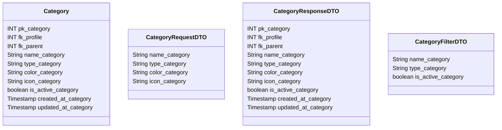

# 📑 Categoria

---

## 📋 Descrição

A **Categoria** representa uma classificação para transações financeiras, permitindo organizar e analisar movimentações
por tipo de gasto ou receita. Cada categoria pode ter subcategorias e está associada a um perfil.

---

| Nome do Atributo    | Tipo         | Descrição           | Restrições    |
|---------------------|--------------|---------------------|---------------|
| pk_category         | INT          | Identificador único | PRIMARY KEY   |
| fk_profile          | INT          | Perfil da categoria | FOREIGN KEY   |
| fk_parent           | INT          | Categoria pai       | FOREIGN KEY   |
| name_category       | VARCHAR(100) | Nome da categoria   | NOT NULL      |
| type_category       | VARCHAR(20)  | Tipo da categoria   | NOT NULL      |
| color_category      | VARCHAR(7)   | Cor da categoria    | NOT NULL      |
| icon_category       | VARCHAR(50)  | Ícone da categoria  | NOT NULL      |
| is_active_category  | BOOLEAN      | Categoria ativa     | DEFAULT TRUE  |
| created_at_category | TIMESTAMP    | Data de criação     | DEFAULT NOW() |
| updated_at_category | TIMESTAMP    | Data de atualização | DEFAULT NOW() |

---

## 📝 Descrição Detalhada

- **pk_category**: identificador único da categoria no sistema. Chave primária autoincrementada.
- **fk_profile**: referência ao perfil dono da categoria. Chave estrangeira para a tabela de perfis.
- **fk_parent**: referência à categoria pai (para subcategorias). Chave estrangeira para a própria tabela de categorias.
- **name_category**: nome da categoria financeira.
- **type_category**: tipo da categoria (ex: receita, despesa, transferência).
- **color_category**: cor associada à categoria (formato hexadecimal).
- **icon_category**: ícone associado à categoria.
- **is_active_category**: indica se a categoria está ativa no sistema.
- **created_at_category**: data e hora de criação do registro da categoria.
- **updated_at_category**: data e hora da última atualização do registro da categoria.

---

## 📊 Diagrama de Classes

## 🔄 Relacionamentos

* **📑 Categoria**
    * ⬅️ Pertence a um perfil (N:1)
    * ⬅️ Pode ter uma categoria pai (N:1)
    * ➡️ Pode ter subcategorias (1:N)
    * ➡️ Múltiplas transações (1:N)
    * ➡️ Múltiplos orçamentos (1:N) 