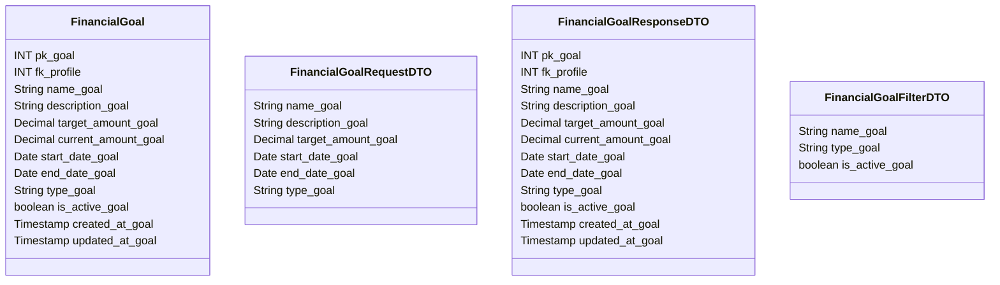

# 🎯 Meta Financeira

---

## 📋 Descrição

A **Meta Financeira** representa um objetivo financeiro que um usuário ou grupo deseja alcançar, como comprar um carro,
fazer uma viagem ou juntar dinheiro para emergências. Cada meta possui um valor alvo, prazo e progresso.

---

| Nome do Atributo    | Tipo         | Descrição           | Restrições    |
|---------------------|--------------|---------------------|---------------|
| pk_goal             | INT          | Identificador único | PRIMARY KEY   |
| fk_profile          | INT          | Perfil da meta      | FOREIGN KEY   |
| name_goal           | VARCHAR(100) | Nome da meta        | NOT NULL      |
| description_goal    | TEXT         | Descrição da meta   | NULL          |
| target_amount_goal  | DECIMAL      | Valor alvo          | NOT NULL      |
| current_amount_goal | DECIMAL      | Valor atual         | NOT NULL      |
| start_date_goal     | DATE         | Data de início      | NOT NULL      |
| end_date_goal       | DATE         | Data de término     | NOT NULL      |
| type_goal           | VARCHAR(50)  | Tipo da meta        | NOT NULL      |
| is_active_goal      | BOOLEAN      | Meta ativa          | DEFAULT TRUE  |
| created_at_goal     | TIMESTAMP    | Data de criação     | DEFAULT NOW() |
| updated_at_goal     | TIMESTAMP    | Data de atualização | DEFAULT NOW() |

---

## 📝 Descrição Detalhada

- **pk_goal**: identificador único da meta no sistema. Chave primária autoincrementada.
- **fk_profile**: referência ao perfil dono da meta. Chave estrangeira para a tabela de perfis.
- **name_goal**: nome da meta financeira.
- **description_goal**: descrição detalhada da meta e seus objetivos.
- **target_amount_goal**: valor total que se deseja alcançar.
- **current_amount_goal**: valor atual acumulado para a meta.
- **start_date_goal**: data em que a meta começou.
- **end_date_goal**: data limite para alcançar a meta.
- **type_goal**: tipo da meta (ex: compra, viagem, emergência).
- **is_active_goal**: indica se a meta está ativa no sistema.
- **created_at_goal**: data e hora de criação do registro da meta.
- **updated_at_goal**: data e hora da última atualização do registro da meta.

---

## 📊 Diagrama de Classes

## 🔄 Relacionamentos

* **🎯 Meta Financeira**
    * ⬅️ Pertence a um perfil (N:1)
    * ➡️ Múltiplas transações (1:N)
    * ➡️ Múltiplos compartilhamentos (1:N)
    * ➡️ Múltiplos lembretes (1:N)