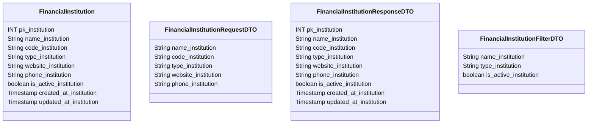

# 🏦 Instituição Financeira

---

## 📋 Descrição

A **Instituição Financeira** representa um banco, fintech ou outra instituição financeira no sistema. Cada instituição
pode ter múltiplas contas associadas e possui informações específicas de contato e operação.

---

| Nome do Atributo       | Tipo         | Descrição               | Restrições    |
|------------------------|--------------|-------------------------|---------------|
| pk_institution         | INT          | Identificador único     | PRIMARY KEY   |
| name_institution       | VARCHAR(100) | Nome da instituição     | NOT NULL      |
| code_institution       | VARCHAR(10)  | Código da instituição   | NOT NULL      |
| type_institution       | VARCHAR(50)  | Tipo da instituição     | NOT NULL      |
| website_institution    | VARCHAR(255) | Site da instituição     | NULL          |
| phone_institution      | VARCHAR(20)  | Telefone da instituição | NULL          |
| is_active_institution  | BOOLEAN      | Instituição ativa       | DEFAULT TRUE  |
| created_at_institution | TIMESTAMP    | Data de criação         | DEFAULT NOW() |
| updated_at_institution | TIMESTAMP    | Data de atualização     | DEFAULT NOW() |

---

## 📝 Descrição Detalhada

- **pk_institution**: identificador único da instituição no sistema. Chave primária autoincrementada.
- **name_institution**: nome completo da instituição financeira.
- **code_institution**: código identificador da instituição (ex: código do banco).
- **type_institution**: tipo da instituição (ex: banco, fintech, corretora).
- **website_institution**: site oficial da instituição.
- **phone_institution**: número de telefone para contato com a instituição.
- **is_active_institution**: indica se a instituição está ativa no sistema.
- **created_at_institution**: data e hora de criação do registro da instituição.
- **updated_at_institution**: data e hora da última atualização do registro da instituição.

---

## 📊 Diagrama de Classes

## 🔄 Relacionamentos

* **🏦 Instituição Financeira**
    * ➡️ Múltiplas contas (1:N)
    * ➡️ Múltiplos cartões (1:N)
    * ➡️ Múltiplos métodos de pagamento (1:N)