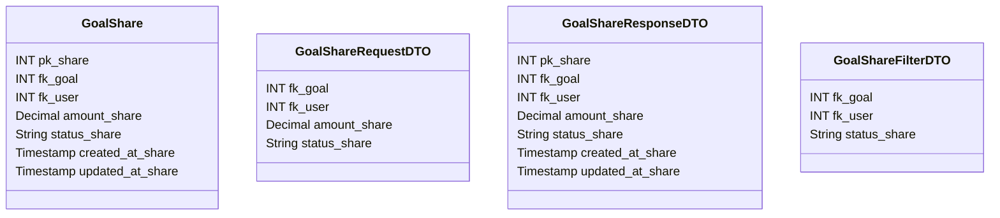

# 🎯 Compartilhamento de Meta

---

## 📋 Descrição

O **Compartilhamento de Meta** representa a divisão de uma meta financeira entre múltiplos usuários, permitindo o
gerenciamento colaborativo de objetivos financeiros. Cada compartilhamento define a parte da meta que cada usuário deve
contribuir.

---

| Nome do Atributo | Tipo          | Descrição                  | Restrições    |
|------------------|---------------|----------------------------|---------------|
| pk_share         | INT           | Identificador único        | PRIMARY KEY   |
| fk_goal          | INT           | Meta compartilhada         | FOREIGN KEY   |
| fk_user          | INT           | Usuário compartilhado      | FOREIGN KEY   |
| amount_share     | DECIMAL(10,2) | Valor compartilhado        | NOT NULL      |
| status_share     | VARCHAR(20)   | Status do compartilhamento | NOT NULL      |
| created_at_share | TIMESTAMP     | Data de criação            | DEFAULT NOW() |
| updated_at_share | TIMESTAMP     | Data de atualização        | DEFAULT NOW() |

---

## 📝 Descrição Detalhada

- **pk_share**: identificador único do compartilhamento no sistema. Chave primária autoincrementada.
- **fk_goal**: referência à meta que está sendo compartilhada. Chave estrangeira para a tabela de metas.
- **fk_user**: referência ao usuário com quem a meta está sendo compartilhada. Chave estrangeira para a tabela de
  usuários.
- **amount_share**: valor da parte da meta que cabe ao usuário contribuir.
- **status_share**: status do compartilhamento (ex: pendente, aprovado, rejeitado, contribuindo).
- **created_at_share**: data e hora de criação do registro do compartilhamento.
- **updated_at_share**: data e hora da última atualização do registro do compartilhamento.

---

## 📊 Diagrama de Classes

## 🔄 Relacionamentos

* **🎯 Compartilhamento de Meta**
    * ⬅️ Pertence a uma meta (N:1)
    * ⬅️ Pertence a um usuário (N:1)
    * ➡️ Múltiplas contribuições (1:N)
    * ➡️ Múltiplas notificações (1:N) 