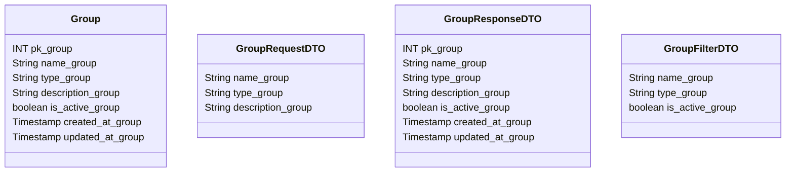

# 👥 Grupo

---

## 📋 Descrição

O **Grupo** representa um conjunto de usuários que compartilham recursos financeiros, como contas, transações e metas.
Cada grupo possui suas próprias configurações de privacidade e permissões.

---

| Nome do Atributo  | Tipo         | Descrição           | Restrições    |
|-------------------|--------------|---------------------|---------------|
| pk_group          | INT          | Identificador único | PRIMARY KEY   |
| name_group        | VARCHAR(100) | Nome do grupo       | NOT NULL      |
| type_group        | VARCHAR(50)  | Tipo do grupo       | NOT NULL      |
| description_group | TEXT         | Descrição do grupo  | NULL          |
| is_active_group   | BOOLEAN      | Grupo ativo         | DEFAULT TRUE  |
| created_at_group  | TIMESTAMP    | Data de criação     | DEFAULT NOW() |
| updated_at_group  | TIMESTAMP    | Data de atualização | DEFAULT NOW() |

---

## 📝 Descrição Detalhada

- **pk_group**: identificador único do grupo no sistema. Chave primária autoincrementada.
- **name_group**: nome do grupo financeiro.
- **type_group**: tipo do grupo (ex: familiar, casal, amigos, empresa).
- **description_group**: descrição detalhada do grupo e seus objetivos.
- **is_active_group**: indica se o grupo está ativo no sistema.
- **created_at_group**: data e hora de criação do registro do grupo.
- **updated_at_group**: data e hora da última atualização do registro do grupo.

---

## 📊 Diagrama de Classes

## 🔄 Relacionamentos

* **👥 Grupo**
    * ➡️ Múltiplos usuários (N:M)
    * ➡️ Múltiplas contas (1:N)
    * ➡️ Múltiplas transações (1:N)
    * ➡️ Múltiplas metas (1:N)
    * ➡️ Múltiplos convites (1:N)