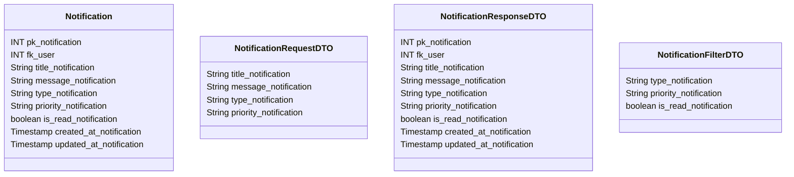

# 🔔 Notificação

---

## 📋 Descrição

A **Notificação** representa uma mensagem enviada ao usuário sobre eventos importantes do sistema, como pagamentos,
lembretes, alertas de orçamento ou convites. Cada notificação pode ser configurada com diferentes prioridades e métodos
de entrega.

---

| Nome do Atributo        | Tipo         | Descrição                 | Restrições    |
|-------------------------|--------------|---------------------------|---------------|
| pk_notification         | INT          | Identificador único       | PRIMARY KEY   |
| fk_user                 | INT          | Usuário da notificação    | FOREIGN KEY   |
| title_notification      | VARCHAR(100) | Título da notificação     | NOT NULL      |
| message_notification    | TEXT         | Mensagem da notificação   | NOT NULL      |
| type_notification       | VARCHAR(50)  | Tipo da notificação       | NOT NULL      |
| priority_notification   | VARCHAR(20)  | Prioridade da notificação | NOT NULL      |
| is_read_notification    | BOOLEAN      | Notificação lida          | DEFAULT FALSE |
| created_at_notification | TIMESTAMP    | Data de criação           | DEFAULT NOW() |
| updated_at_notification | TIMESTAMP    | Data de atualização       | DEFAULT NOW() |

---

## 📝 Descrição Detalhada

- **pk_notification**: identificador único da notificação no sistema. Chave primária autoincrementada.
- **fk_user**: referência ao usuário que receberá a notificação. Chave estrangeira para a tabela de usuários.
- **title_notification**: título da notificação.
- **message_notification**: mensagem detalhada da notificação.
- **type_notification**: tipo da notificação (ex: pagamento, lembrete, alerta, convite).
- **priority_notification**: prioridade da notificação (ex: alta, média, baixa).
- **is_read_notification**: indica se a notificação foi lida pelo usuário.
- **created_at_notification**: data e hora de criação do registro da notificação.
- **updated_at_notification**: data e hora da última atualização do registro da notificação.

---

## 📊 Diagrama de Classes

## 🔄 Relacionamentos

* **🔔 Notificação**
    * ⬅️ Pertence a um usuário (N:1)
    * ➡️ Múltiplos métodos de entrega (1:N)
    * ➡️ Múltiplas ações (1:N) 