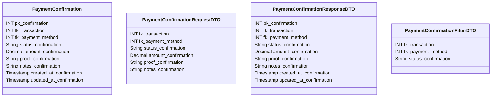

# ✅ Confirmação de Pagamento

---

## 📋 Descrição

A **Confirmação de Pagamento** representa a confirmação de um pagamento realizado, contendo informações sobre o status,
método de pagamento e detalhes da transação. Cada confirmação está associada a uma transação específica e pode incluir
comprovantes ou evidências do pagamento.

---

| Nome do Atributo        | Tipo          | Descrição                | Restrições    |
|-------------------------|---------------|--------------------------|---------------|
| pk_confirmation         | INT           | Identificador único      | PRIMARY KEY   |
| fk_transaction          | INT           | Transação confirmada     | FOREIGN KEY   |
| fk_payment_method       | INT           | Método de pagamento      | FOREIGN KEY   |
| status_confirmation     | VARCHAR(20)   | Status da confirmação    | NOT NULL      |
| amount_confirmation     | DECIMAL(10,2) | Valor confirmado         | NOT NULL      |
| proof_confirmation      | VARCHAR(255)  | Comprovante do pagamento | NULL          |
| notes_confirmation      | TEXT          | Observações              | NULL          |
| created_at_confirmation | TIMESTAMP     | Data de criação          | DEFAULT NOW() |
| updated_at_confirmation | TIMESTAMP     | Data de atualização      | DEFAULT NOW() |

---

## 📝 Descrição Detalhada

- **pk_confirmation**: identificador único da confirmação no sistema. Chave primária autoincrementada.
- **fk_transaction**: referência à transação que está sendo confirmada. Chave estrangeira para a tabela de transações.
- **fk_payment_method**: referência ao método de pagamento utilizado. Chave estrangeira para a tabela de métodos de
  pagamento.
- **status_confirmation**: status da confirmação (ex: pendente, confirmado, rejeitado, em análise).
- **amount_confirmation**: valor do pagamento confirmado.
- **proof_confirmation**: caminho ou referência para o comprovante do pagamento (ex: imagem, PDF).
- **notes_confirmation**: observações adicionais sobre a confirmação do pagamento.
- **created_at_confirmation**: data e hora de criação do registro da confirmação.
- **updated_at_confirmation**: data e hora da última atualização do registro da confirmação.

---

## 📊 Diagrama de Classes

## 🔄 Relacionamentos

* **✅ Confirmação de Pagamento**
    * ⬅️ Pertence a uma transação (N:1)
    * ⬅️ Pertence a um método de pagamento (N:1)
    * ➡️ Múltiplas notificações (1:N)
    * ➡️ Múltiplos logs (1:N)