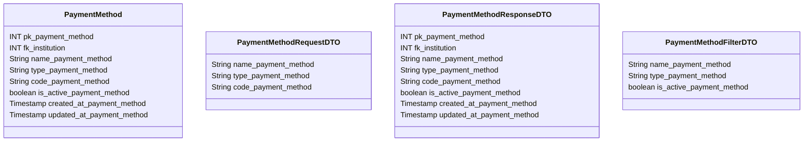

# 💱 Método de Pagamento

---

## 📋 Descrição

O **Método de Pagamento** representa uma forma de realizar pagamentos no sistema, como PIX, boleto, cartão de crédito,
entre outros. Cada método possui suas próprias características e regras de processamento.

---

| Nome do Atributo          | Tipo         | Descrição             | Restrições    |
|---------------------------|--------------|-----------------------|---------------|
| pk_payment_method         | INT          | Identificador único   | PRIMARY KEY   |
| fk_institution            | INT          | Instituição do método | FOREIGN KEY   |
| name_payment_method       | VARCHAR(100) | Nome do método        | NOT NULL      |
| type_payment_method       | VARCHAR(50)  | Tipo do método        | NOT NULL      |
| code_payment_method       | VARCHAR(20)  | Código do método      | NOT NULL      |
| is_active_payment_method  | BOOLEAN      | Método ativo          | DEFAULT TRUE  |
| created_at_payment_method | TIMESTAMP    | Data de criação       | DEFAULT NOW() |
| updated_at_payment_method | TIMESTAMP    | Data de atualização   | DEFAULT NOW() |

---

## 📝 Descrição Detalhada

- **pk_payment_method**: identificador único do método de pagamento no sistema. Chave primária autoincrementada.
- **fk_institution**: referência à instituição financeira que oferece o método. Chave estrangeira para a tabela de
  instituições.
- **name_payment_method**: nome do método de pagamento (ex: PIX, Boleto, Cartão de Crédito).
- **type_payment_method**: tipo do método (ex: instantâneo, agendado, parcelado).
- **code_payment_method**: código identificador do método no sistema.
- **is_active_payment_method**: indica se o método está ativo no sistema.
- **created_at_payment_method**: data e hora de criação do registro do método.
- **updated_at_payment_method**: data e hora da última atualização do registro do método.

---

## 📊 Diagrama de Classes

## 🔄 Relacionamentos

* **💱 Método de Pagamento**
    * ⬅️ Pertence a uma instituição financeira (N:1)
    * ➡️ Múltiplas transações (1:N)
    * ➡️ Múltiplos pagamentos (1:N)
    * ➡️ Múltiplas confirmações (1:N) 