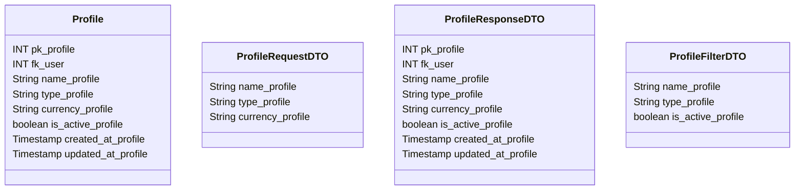

# 👤 Perfil

---

## 📋 Descrição

O **Perfil** representa uma identidade financeira específica de um usuário no sistema. Um usuário pode ter múltiplos
perfis, cada um com suas próprias contas, transações e configurações financeiras.

---

| Nome do Atributo   | Tipo         | Descrição              | Restrições    |
|--------------------|--------------|------------------------|---------------|
| pk_profile         | INT          | Identificador único    | PRIMARY KEY   |
| fk_user            | INT          | Usuário dono do perfil | FOREIGN KEY   |
| name_profile       | VARCHAR(100) | Nome do perfil         | NOT NULL      |
| type_profile       | VARCHAR(50)  | Tipo do perfil         | NOT NULL      |
| currency_profile   | VARCHAR(3)   | Moeda padrão           | NOT NULL      |
| is_active_profile  | BOOLEAN      | Perfil ativo           | DEFAULT TRUE  |
| created_at_profile | TIMESTAMP    | Data de criação        | DEFAULT NOW() |
| updated_at_profile | TIMESTAMP    | Data de atualização    | DEFAULT NOW() |

---

## 📝 Descrição Detalhada

- **pk_profile**: identificador único do perfil no sistema. Chave primária autoincrementada.
- **fk_user**: referência ao usuário dono do perfil. Chave estrangeira para a tabela de usuários.
- **name_profile**: nome do perfil financeiro. Pode ser usado para identificar diferentes contextos financeiros.
- **type_profile**: tipo do perfil (ex: pessoal, empresarial, familiar).
- **currency_profile**: moeda padrão utilizada no perfil (ex: BRL, USD, EUR).
- **is_active_profile**: indica se o perfil está ativo no sistema.
- **created_at_profile**: data e hora de criação do registro do perfil.
- **updated_at_profile**: data e hora da última atualização do registro do perfil.

---

## 📊 Diagrama de Classes

## 🔄 Relacionamentos

* **👤 Perfil**
    * ⬅️ Pertence a um usuário (N:1)
    * ➡️ Múltiplas contas (1:N)
    * ➡️ Múltiplas transações (1:N)
    * ➡️ Múltiplas metas financeiras (1:N)
    * ➡️ Múltiplos orçamentos (1:N)
    * ➡️ Múltiplas categorias (1:N)
    * ➡️ Múltiplos cartões (1:N)