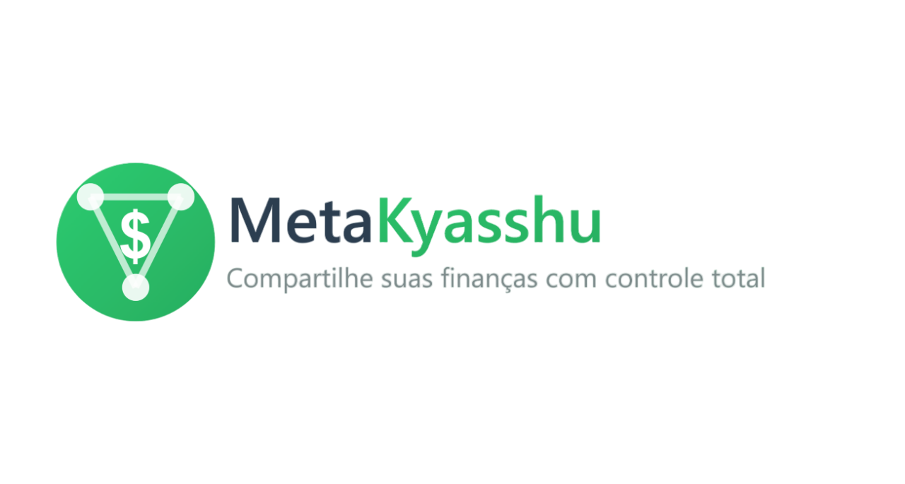

# 💰 Visão Geral do Projeto (METAKYASSHU)

#### ✨ Transformando finanças em experiências compartilhadas ✨

---

## 📜 Introdução

O **Sistema de Controle Financeiro Compartilhado (`METAKYASSHU`)** é uma aplicação web inovadora para o gerenciamento
financeiro de grupos e indivíduos. Ele facilita o compartilhamento de despesas, orçamentos e metas financeiras,
promovendo organização, transparência e colaboração. Além disso, oferece ferramentas completas para monitoramento de
receitas, despesas e investimentos, além da geração de relatórios detalhados para uma gestão mais estratégica.

## ❓ Problema

A gestão financeira compartilhada apresenta diversos desafios, especialmente quando envolve:

- 💸 Diferentes hábitos de consumo
- 🎯 Prioridades financeiras distintas
- 📊 Falta de organização nos gastos
- 🤝 Dificuldade na divisão de despesas
- 📱 Ausência de ferramentas adequadas

## 💡 Solução

O `METAKYASSHU` oferece uma solução abrangente para o gerenciamento financeiro compartilhado, fornecendo os seguintes
recursos:

* **💹 Rastreamento de despesas:** Registre e categorize todas as despesas realizadas pelo grupo, com opção de anexar
  recibos e notas fiscais.
* **📊 Orçamentos compartilhados:** Crie e gerencie orçamentos para diferentes categorias de gastos, definindo limites e
  acompanhando o progresso.
* **🎯 Metas financeiras:** Defina metas financeiras individuais e em grupo, acompanhe o progresso e receba notificações.
* **💰 Divisão de contas:** Divida contas e despesas de forma justa entre os membros do grupo, com múltiplas opções de
  divisão.
* **💳 Gerenciamento de dívidas:** Acompanhe e gerencie dívidas compartilhadas, incluindo prazos e juros.
* **📈 Relatórios e análises:** Gere relatórios detalhados sobre os gastos do grupo, identificando tendências e
  economias.
* **💬 Comunicação e colaboração:** Facilite a comunicação entre os membros do grupo para decisões financeiras conjuntas.

## 👥 Público-alvo

O `METAKYASSHU` é direcionado a diversos grupos que compartilham despesas:

* 👨‍👩‍👧‍👦 Famílias
* 💑 Casais
* 🤝 Amigos
* 🏠 Colegas de quarto/moradia compartilhada
* 💼 Grupos de trabalho
* 🏢 Pequenas empresas

## ✅ Benefícios

O sistema oferece diversos benefícios aos seus usuários:

* **📱 Maior organização e controle:** Acompanhamento e gerenciamento eficiente dos gastos em grupo.
* **🤝 Transparência e colaboração:** Promove comunicação clara e decisões financeiras conjuntas.
* **⚡ Economia de tempo e dinheiro:** Automatização de tarefas e identificação de oportunidades de economia.
* **🎯 Alcance de metas:** Ferramentas para acompanhamento e controle do progresso financeiro.
* **❤️ Relacionamentos saudáveis:** Evita conflitos relacionados a questões financeiras.

## 🎯 Objetivos

Os principais objetivos do `METAKYASSHU` são:

* **🌟 Controle financeiro pessoal completo**
* **🔒 Compartilhamento seletivo e seguro de dados financeiros**
* **👥 Colaboração financeira entre diferentes tipos de grupos**
* **📚 Educação financeira integrada**
* **⚡ Automação de processos repetitivos**
* **💡 Facilidade de uso com interface intuitiva**
* **🤝 Promoção de organização e transparência**

## 🏗️ Arquitetura

O `METAKYASSHU` é desenvolvido com uma arquitetura moderna de microserviços, utilizando tecnologias robustas para
garantir escalabilidade, segurança e desempenho:

- 🌐 **Frontend**:
    - Angular 17+ com Material Design
    - Progressive Web App (PWA)
    - Versões nativas para mobile (Kotlin/Android) e desktop (Kotlin/Compose MP)

- ⚙️ **Backend**:
    - Spring Boot 3.x com microserviços especializados
    - Spring Security com JWT/OAuth2
    - API Gateway para gerenciamento de requisições
    - Serviços dedicados: Auth, User, Financial, Group, Notification, Analytics, Integration e File

- 🗄️ **Persistência e Cache**:
    - MySQL 8.x com replicação master-slave
    - Redis para cache e sessões
    - MinIO para armazenamento de arquivos criptografados

- ☁️ **Infraestrutura**:
    - Docker e Docker Compose
    - Monitoramento com Prometheus, Grafana e Jaeger
    - ELK Stack para gestão de logs

- 🔒 **Segurança**:
    - Autenticação multi-fator
    - Criptografia end-to-end
    - Compliance com LGPD e PCI-DSS

---

> ---------------------------------------------------------------------------
> #### 💰 METAKYASSHU 💰
> ***Transformando finanças em conquistas compartilhadas***
> ---------------------------------------------------------------------------