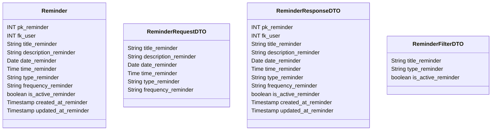

# ⏰ Lembrete

---

## 📋 Descrição

O **Lembrete** representa uma notificação programada para lembrar sobre transações, pagamentos, metas ou outros eventos
financeiros importantes. Cada lembrete pode ser configurado com diferentes frequências e métodos de notificação.

---

| Nome do Atributo     | Tipo         | Descrição              | Restrições    |
|----------------------|--------------|------------------------|---------------|
| pk_reminder          | INT          | Identificador único    | PRIMARY KEY   |
| fk_user              | INT          | Usuário do lembrete    | FOREIGN KEY   |
| title_reminder       | VARCHAR(100) | Título do lembrete     | NOT NULL      |
| description_reminder | TEXT         | Descrição do lembrete  | NULL          |
| date_reminder        | DATE         | Data do lembrete       | NOT NULL      |
| time_reminder        | TIME         | Hora do lembrete       | NOT NULL      |
| type_reminder        | VARCHAR(50)  | Tipo do lembrete       | NOT NULL      |
| frequency_reminder   | VARCHAR(20)  | Frequência do lembrete | NOT NULL      |
| is_active_reminder   | BOOLEAN      | Lembrete ativo         | DEFAULT TRUE  |
| created_at_reminder  | TIMESTAMP    | Data de criação        | DEFAULT NOW() |
| updated_at_reminder  | TIMESTAMP    | Data de atualização    | DEFAULT NOW() |

---

## 📝 Descrição Detalhada

- **pk_reminder**: identificador único do lembrete no sistema. Chave primária autoincrementada.
- **fk_user**: referência ao usuário dono do lembrete. Chave estrangeira para a tabela de usuários.
- **title_reminder**: título do lembrete.
- **description_reminder**: descrição detalhada do lembrete.
- **date_reminder**: data em que o lembrete deve ser acionado.
- **time_reminder**: hora em que o lembrete deve ser acionado.
- **type_reminder**: tipo do lembrete (ex: pagamento, meta, transação).
- **frequency_reminder**: frequência do lembrete (ex: único, diário, semanal, mensal).
- **is_active_reminder**: indica se o lembrete está ativo no sistema.
- **created_at_reminder**: data e hora de criação do registro do lembrete.
- **updated_at_reminder**: data e hora da última atualização do registro do lembrete.

---

## 📊 Diagrama de Classes

## 🔄 Relacionamentos

* **⏰ Lembrete**
    * ⬅️ Pertence a um usuário (N:1)
    * ➡️ Múltiplas notificações (1:N)
    * ➡️ Múltiplas transações (1:N)
    * ➡️ Múltiplas metas (1:N)
