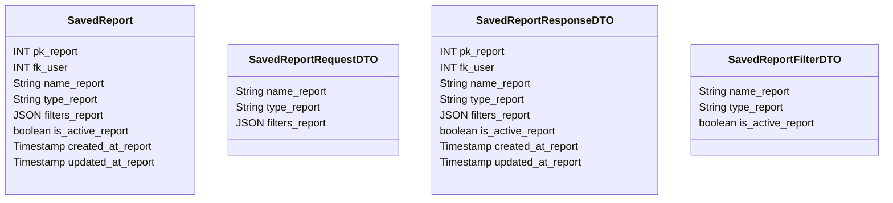

# 📑 Relatório Salvo

---

## 📋 Descrição

O **Relatório Salvo** representa um relatório financeiro personalizado que foi salvo pelo usuário para consultas
futuras. Cada relatório pode conter diferentes tipos de análises e visualizações dos dados financeiros.

---

| Nome do Atributo  | Tipo         | Descrição            | Restrições    |
|-------------------|--------------|----------------------|---------------|
| pk_report         | INT          | Identificador único  | PRIMARY KEY   |
| fk_user           | INT          | Usuário do relatório | FOREIGN KEY   |
| name_report       | VARCHAR(100) | Nome do relatório    | NOT NULL      |
| type_report       | VARCHAR(50)  | Tipo do relatório    | NOT NULL      |
| filters_report    | JSON         | Filtros do relatório | NOT NULL      |
| is_active_report  | BOOLEAN      | Relatório ativo      | DEFAULT TRUE  |
| created_at_report | TIMESTAMP    | Data de criação      | DEFAULT NOW() |
| updated_at_report | TIMESTAMP    | Data de atualização  | DEFAULT NOW() |

---

## 📝 Descrição Detalhada

- **pk_report**: identificador único do relatório no sistema. Chave primária autoincrementada.
- **fk_user**: referência ao usuário dono do relatório. Chave estrangeira para a tabela de usuários.
- **name_report**: nome do relatório financeiro.
- **type_report**: tipo do relatório (ex: despesas, receitas, saldo, categorias).
- **filters_report**: configurações e filtros do relatório em formato JSON.
- **is_active_report**: indica se o relatório está ativo no sistema.
- **created_at_report**: data e hora de criação do registro do relatório.
- **updated_at_report**: data e hora da última atualização do registro do relatório.

---

## 📊 Diagrama de Classes

## 🔄 Relacionamentos

* **📑 Relatório Salvo**
    * ⬅️ Pertence a um usuário (N:1)
    * ➡️ Múltiplas visualizações (1:N)
    * ➡️ Múltiplos compartilhamentos (1:N)
