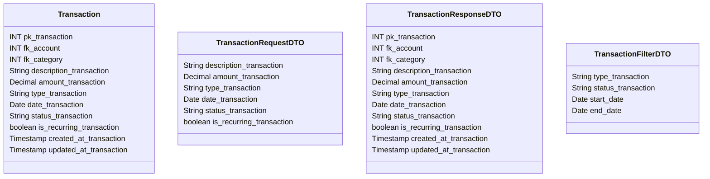

# 💸 Transação

---

## 📋 Descrição

A **Transação** representa um movimento financeiro em uma conta, podendo ser uma entrada (receita) ou saída (despesa).
Cada transação está associada a uma categoria, conta e pode ter múltiplos compartilhamentos.

---

| Nome do Atributo         | Tipo         | Descrição              | Restrições    |
|--------------------------|--------------|------------------------|---------------|
| pk_transaction           | INT          | Identificador único    | PRIMARY KEY   |
| fk_account               | INT          | Conta da transação     | FOREIGN KEY   |
| fk_category              | INT          | Categoria da transação | FOREIGN KEY   |
| description_transaction  | VARCHAR(255) | Descrição da transação | NOT NULL      |
| amount_transaction       | DECIMAL      | Valor da transação     | NOT NULL      |
| type_transaction         | VARCHAR(20)  | Tipo da transação      | NOT NULL      |
| date_transaction         | DATE         | Data da transação      | NOT NULL      |
| status_transaction       | VARCHAR(20)  | Status da transação    | NOT NULL      |
| is_recurring_transaction | BOOLEAN      | Transação recorrente   | DEFAULT FALSE |
| created_at_transaction   | TIMESTAMP    | Data de criação        | DEFAULT NOW() |
| updated_at_transaction   | TIMESTAMP    | Data de atualização    | DEFAULT NOW() |

---

## 📝 Descrição Detalhada

- **pk_transaction**: identificador único da transação no sistema. Chave primária autoincrementada.
- **fk_account**: referência à conta onde a transação ocorreu. Chave estrangeira para a tabela de contas.
- **fk_category**: referência à categoria da transação. Chave estrangeira para a tabela de categorias.
- **description_transaction**: descrição detalhada da transação.
- **amount_transaction**: valor monetário da transação.
- **type_transaction**: tipo da transação (ex: receita, despesa, transferência).
- **date_transaction**: data em que a transação ocorreu.
- **status_transaction**: status atual da transação (ex: pendente, confirmada, cancelada).
- **is_recurring_transaction**: indica se a transação é recorrente.
- **created_at_transaction**: data e hora de criação do registro da transação.
- **updated_at_transaction**: data e hora da última atualização do registro da transação.

---

## 📊 Diagrama de Classes

## 🔄 Relacionamentos

* **💸 Transação**
    * ⬅️ Pertence a uma conta (N:1)
    * ⬅️ Pertence a uma categoria (N:1)
    * ➡️ Múltiplos compartilhamentos (1:N)
    * ➡️ Múltiplos lembretes (1:N)
    * ➡️ Múltiplos pagamentos (1:N)