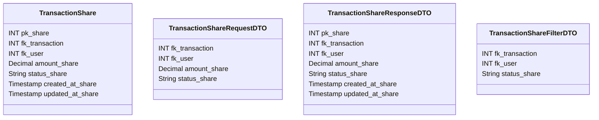

# 💱 Compartilhamento de Transação

---

## 📋 Descrição

O **Compartilhamento de Transação** representa a divisão de uma transação entre múltiplos usuários, permitindo o
gerenciamento de despesas compartilhadas. Cada compartilhamento define a parte da transação que cada usuário deve pagar
ou receber.

---

| Nome do Atributo | Tipo          | Descrição                  | Restrições    |
|------------------|---------------|----------------------------|---------------|
| pk_share         | INT           | Identificador único        | PRIMARY KEY   |
| fk_transaction   | INT           | Transação compartilhada    | FOREIGN KEY   |
| fk_user          | INT           | Usuário compartilhado      | FOREIGN KEY   |
| amount_share     | DECIMAL(10,2) | Valor compartilhado        | NOT NULL      |
| status_share     | VARCHAR(20)   | Status do compartilhamento | NOT NULL      |
| created_at_share | TIMESTAMP     | Data de criação            | DEFAULT NOW() |
| updated_at_share | TIMESTAMP     | Data de atualização        | DEFAULT NOW() |

---

## 📝 Descrição Detalhada

- **pk_share**: identificador único do compartilhamento no sistema. Chave primária autoincrementada.
- **fk_transaction**: referência à transação que está sendo compartilhada. Chave estrangeira para a tabela de
  transações.
- **fk_user**: referência ao usuário com quem a transação está sendo compartilhada. Chave estrangeira para a tabela de
  usuários.
- **amount_share**: valor da parte da transação que cabe ao usuário.
- **status_share**: status do compartilhamento (ex: pendente, aprovado, rejeitado, pago).
- **created_at_share**: data e hora de criação do registro do compartilhamento.
- **updated_at_share**: data e hora da última atualização do registro do compartilhamento.

---

## 📊 Diagrama de Classes

## 🔄 Relacionamentos

* **💱 Compartilhamento de Transação**
    * ⬅️ Pertence a uma transação (N:1)
    * ⬅️ Pertence a um usuário (N:1)
    * ➡️ Múltiplos pagamentos (1:N)
    * ➡️ Múltiplas notificações (1:N) 