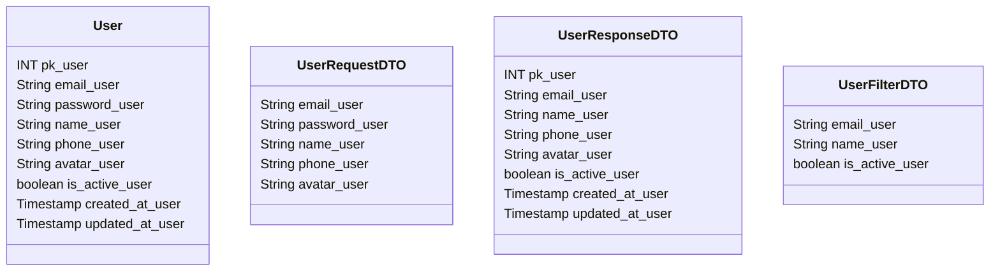

# 👤 Usuário

---

## 📋 Descrição

O **Usuário** representa uma pessoa que utiliza o sistema, podendo ter múltiplos perfis financeiros e participar de
diferentes grupos. Cada usuário possui suas próprias configurações de privacidade e notificações.

---

| Nome do Atributo | Tipo         | Descrição           | Restrições       |
|------------------|--------------|---------------------|------------------|
| pk_user          | INT          | Identificador único | PRIMARY KEY      |
| email_user       | VARCHAR(255) | Email do usuário    | UNIQUE, NOT NULL |
| password_user    | VARCHAR(255) | Hash da senha       | NOT NULL         |
| name_user        | VARCHAR(100) | Nome do usuário     | NOT NULL         |
| phone_user       | VARCHAR(20)  | Telefone            | NULL             |
| avatar_user      | VARCHAR(500) | URL do avatar       | NULL             |
| is_active_user   | BOOLEAN      | Usuário ativo       | DEFAULT TRUE     |
| created_at_user  | TIMESTAMP    | Data de criação     | DEFAULT NOW()    |
| updated_at_user  | TIMESTAMP    | Data de atualização | DEFAULT NOW()    |

---

## 📝 Descrição Detalhada

- **pk_user**: identificador único do usuário no sistema. Chave primária autoincrementada.
- **email_user**: endereço de email do usuário. Deve ser único no sistema e válido.
- **name_user**: nome completo do usuário. Pode incluir primeiro e último nome.
- **password_user**: Hash da senha do usuário. Armazenado de forma segura usando algoritmo de hash.
- **phone_user**: Número de telefone do usuário. Formato internacional recomendado.
- **avatar_user**: URL da imagem de perfil do usuário. Pode ser uma URL externa ou interna do sistema.
- **is_active_user**: indica se o usuário está ativo no sistema.
- **created_at_user**: data e hora de criação do registro do usuário.
- **updated_at_user**: data e hora da última atualização do registro do usuário.

---

## 📊 Diagrama de Classes

## 🔄 Relacionamentos

* **👤 Usuário**
    * ➡️ Múltiplos perfis (1:N)
    * ➡️ Múltiplos grupos (N:M)
    * ➡️ Múltiplos lembretes (1:N)
    * ➡️ Múltiplos logs de auditoria (1:N)
    * ➡️ Configurações de notificação (1:1)
    * ➡️ Configurações de privacidade (1:1)