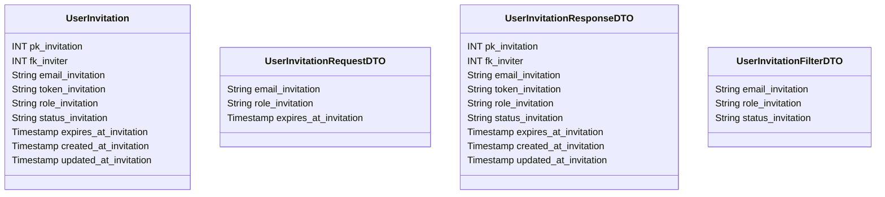

# 📨 Convite de Usuário

---

## 📋 Descrição

O **Convite de Usuário** representa um convite enviado para que um novo usuário se junte ao sistema. Cada convite contém
informações sobre o convidado, o convidante e as permissões que serão concedidas após a aceitação.

---

| Nome do Atributo      | Tipo         | Descrição            | Restrições    |
|-----------------------|--------------|----------------------|---------------|
| pk_invitation         | INT          | Identificador único  | PRIMARY KEY   |
| fk_inviter            | INT          | Usuário que convidou | FOREIGN KEY   |
| email_invitation      | VARCHAR(100) | Email do convidado   | NOT NULL      |
| token_invitation      | VARCHAR(100) | Token do convite     | NOT NULL      |
| role_invitation       | VARCHAR(50)  | Papel do convidado   | NOT NULL      |
| status_invitation     | VARCHAR(20)  | Status do convite    | NOT NULL      |
| expires_at_invitation | TIMESTAMP    | Data de expiração    | NOT NULL      |
| created_at_invitation | TIMESTAMP    | Data de criação      | DEFAULT NOW() |
| updated_at_invitation | TIMESTAMP    | Data de atualização  | DEFAULT NOW() |

---

## 📝 Descrição Detalhada

- **pk_invitation**: identificador único do convite no sistema. Chave primária autoincrementada.
- **fk_inviter**: referência ao usuário que enviou o convite. Chave estrangeira para a tabela de usuários.
- **email_invitation**: email do usuário convidado.
- **token_invitation**: token único gerado para o convite, utilizado para validação.
- **role_invitation**: papel/permissões que serão concedidas ao usuário após aceitar o convite.
- **status_invitation**: status do convite (ex: pendente, aceito, rejeitado, expirado).
- **expires_at_invitation**: data e hora de expiração do convite.
- **created_at_invitation**: data e hora de criação do registro do convite.
- **updated_at_invitation**: data e hora da última atualização do registro do convite.

---

## 📊 Diagrama de Classes

## 🔄 Relacionamentos

* **📨 Convite de Usuário**
    * ⬅️ Pertence a um usuário convidante (N:1)
    * ➡️ Múltiplas notificações (1:N)
    * ➡️ Múltiplos logs (1:N) 